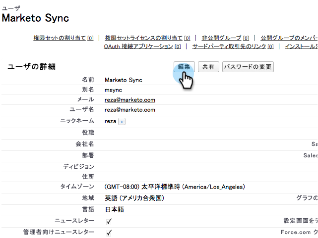

# 영어 이외 사용자 지정 개체 동기화 사용 {#enable-non-english-custom-object-sync}

Marketing to 동기화 사용자가 영어 이외의 언어로 설정된 경우 사용자 지정 개체 동기화를 활성화하려고 할 때 오류가 발생할 수 있습니다.

## 오류 {#the-error}

## 해결 방법 {#getting-around-it}

1. 마케팅을 사용하여 사용자를 동기화하여 Salesforce에 로그인합니다.

   

1. 사용자 이름 아래에서 **설치**&#x200B;로 이동합니다.

   

1. **개인 정보**&#x200B;에서 **내 개인 정보**&#x200B;를 클릭합니다.

   

1. **편집**&#x200B;을 클릭합니다.

   

1. **언어**&#x200B;을 **영어**&#x200B;로 변경합니다.

   

1. **저장**&#x200B;을 클릭합니다.

   

1. Marketing에서 **관리 > Salesforce > 개체**&#x200B;에서 **스키마 새로 고침**&#x200B;을 클릭합니다.

   

1. 그러면 개체 목록이 영어로 풀립니다. 이제 원하는 개체를 선택하고 **동기화 활성화**&#x200B;를 클릭합니다.

   

1. 이제 사용자 정의 개체가 활성화되고 동기화됩니다.

   

1. 이제 Salesforce로 돌아가 위의 단계를 사용하여 동기화 사용자를 다시 원하는 언어로 변경할 수 있습니다.

>[!NOTE]
>
>마지막으로 한 번 스키마 새로 고침으로 개체를 다시 언어로 가져오는 것을 잊지 마십시오.
