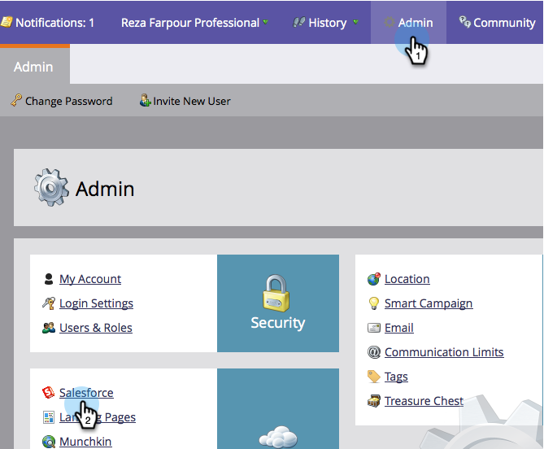

# 기본 사용자 성 및 회사 이름 설정 {#set-default-person-last-name-and-company-name}

[!DNL Salesforce]에는 리드 및 연락처에 성과 회사 이름이 필요합니다(최소). 불완전한 레코드가 [!DNL Salesforce]에 동기화되지 않습니다. 부분 레코드를 동기화하려면 Marketo에서 [!DNL Salesforce]에 사용할 기본값을 설정해야 합니다.

1. **[!UICONTROL Admin]**(으)로 이동하여 **[!DNL Salesforce]**&#x200B;을(를) 클릭합니다.

   

1. **[!UICONTROL Edit Sync Options]**&#x200B;를 클릭합니다.

   

1. **[!UICONTROL Default person last name]** 및 **[!UICONTROL Default person company]**&#x200B;을(를) 입력한 다음 **[!UICONTROL Save]**&#x200B;을(를) 클릭합니다.

   

   >[!NOTE]
   >
   >Marketo Engage은 레코드가 Salesforce에 처음 동기화될 때만 기본값을 할당하며 필수 필드 중 하나가 비어 있는 경우에만 기본값을 할당합니다.

바로 그거야! 성 및/또는 회사 이름이 누락된 사용자가 있을 때마다 Marketo은 레코드를 동기화할 때 기본값을 추가합니다.
