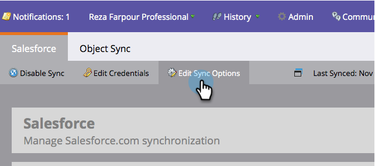

# 기본 개인 성 및 회사 이름 설정 {#set-default-person-last-name-and-company-name}

Salesforce의 리드 및 연락처에 대한 (최소) 성 및 회사 이름이 필요합니다. 불완전한 레코드는 Salesforce와 동기화되지 않습니다. 부분 레코드를 동기화하려면 Marketing to에서 Salesforce에 사용할 기본값을 설정해야 합니다.

1. 관리자로 **이동한** 다음 **Salesforce를 클릭합니다**.

   

1. [ **동기화 옵션 편집]을 클릭합니다**.

   

1. 기본 개인 성 **을** 입력하고 **기본 ****개인 회사를** 입력한 다음 **저장을 클릭합니다**.

   

   >[!NOTE]
   >
   >Marketing to는 레코드가 처음에 Salesforce에 동기화될 때만 기본값을 지정하며 필수 필드 중 하나가 비어 있는 경우에만 지정합니다.

그게 다야! 성이 누락되거나 회사 이름이 누락될 때마다 Marketing to는 레코드를 동기화할 때 기본값을 추가합니다.
