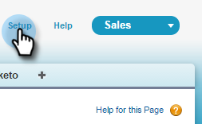
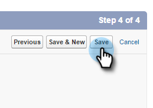

# 3단계 중 1단계:Salesforce(Professional) {#step-of-add-marketo-fields-to-salesforce-professional}에 마케팅 필드 추가

>[!PREREQUISITES]
>
>Salesforce 인스턴스는 Marketing To와 Salesforce 간에 데이터를 동기화하려면 Salesforce API에 액세스할 수 있어야 합니다.

Marketing Cloud에서는 일련의 필드를 사용하여 특정 종류의 마케팅 관련 정보를 캡처합니다. Salesforce에서 이 데이터를 사용하려면 아래 지침을 따르십시오.

1. Salesforce에서 리드 및 연락처 개체에 대해 3개의 사용자 정의 필드를 만듭니다.점수, 획득 프로그램 및 획득 날짜.
1. 리드 및 연락처 간에 이러한 사용자 정의 필드를 매핑하여 Salesforce에서 전환할 때 값이 이월되도록 할 수 있습니다.
1. 필요한 경우 다른 추가 필드를 만들 수 있습니다(아래 표 참조).

이러한 모든 사용자 정의 필드는 선택 사항이며 Marketing Cloud 및 Salesforce를 동기화할 필요가 없습니다. 우수 사례로, 점수, 획득 프로그램 및 획득 날짜에 대한 필드를 만드는 것이 좋습니다.

## Salesforce {#add-marketo-fields-to-salesforce}에 마케팅 필드 추가

위에 나열된 Salesforce에서 리드 및 연락처 개체에 3개의 사용자 정의 필드를 추가합니다. 더 추가하려면 이 섹션 끝에 있는 사용 가능한 필드 표를 참조하십시오.

3개의 사용자 정의 필드 각각에 대해 다음 단계를 수행하여 필드를 추가합니다. **점수**&#x200B;로 시작합니다.

1. Salesforce에 로그인하고 **설정을 클릭합니다.**

   ** 

   **

1. 왼쪽의 [빌드] 메뉴에서 **사용자 지정**&#x200B;을 클릭하고 **리드**&#x200B;을 선택합니다. **필드**&#x200B;를 클릭합니다.

   

1. 페이지 하단의 사용자 지정 필드 및 관계 섹션에서 **새로 만들기**&#x200B;를 클릭합니다.

   

1. 적절한 필드 유형을 선택합니다(점수 — **number**;획득 프로그램 — **텍스트**;획득 날짜 — **날짜/시간**).

   

1. **다음**&#x200B;을 클릭합니다.

   

1. 아래 표와 같이 필드에 필드 레이블, 길이 및 필드 이름을 입력합니다.

<table> 
 <thead> 
  <tr> 
   <th> 
    

      필드 레이블 
    
</th> 
   <th> 
    

      필드 이름 
    
</th> 
   <th> 
    

      데이터 유형 
    
</th> 
   <th> 
    

      필드 속성 
    
</th> 
  </tr> 
 </thead> 
 <tbody> 
  <tr> 
   <td>점수</td> 
   <td>mkto71_Lead_Score</td> 
   <td>숫자</td> 
   <td>길이 10 소수점 자리 0 </td> 
  </tr> 
  <tr> 
   <td>획득 날짜</td> 
   <td>mkto71_Acquisition_Date</td> 
   <td>날짜/시간</td> 
   <td> </td> 
  </tr> 
  <tr> 
   <td>획득 프로그램</td> 
   <td>mkto71_Acquisition_Program</td> 
   <td>텍스트</td> 
   <td>길이 255</td> 
  </tr> 
 </tbody> 
</table>

>[!NOTE]
>
>Salesforce는 API 이름을 만드는 데 사용할 때 필드 이름에 __c를 추가합니다.

>[!NOTE]
>
>텍스트 및 번호 필드에는 길이가 필요하지만 날짜/시간 필드는 길이를 설정할 수 없습니다.설명은 선택 사항입니다.

1. **다음**&#x200B;을 클릭합니다.

   

1. 액세스 설정을 지정하고 **다음**&#x200B;을 클릭합니다.

   * 모든 역할을 **Visible **및 **읽기 전용**&#x200B;으로 설정합니다.

   * 동기화 사용자의 프로필에 대한 **읽기 전용** 확인란의 선택을 취소합니다.

      * 사용자 동기화 사용자로 *시스템 관리자*&#x200B;의 프로파일을 가진 사용자가 있는 경우 시스템 관리자 프로필의 **읽기 전용** 확인란을 선택 취소합니다(아래 참조).

      * 동기화 사용자에 대해 *사용자 지정 프로필*&#x200B;을(를) 만든 경우 해당 사용자 지정 프로필의 **읽기 전용** 확인란 선택을 취소합니다

   

1. 필드를 표시할 페이지 레이아웃을 선택합니다.

   

1. **저장 및 새로 만들기**&#x200B;를 클릭하여 돌아가서 다른 두 사용자 정의 필드를 각각 만듭니다. 3개 모두 완료하면 **저장**&#x200B;을 클릭합니다.

   

1. 왼쪽의 [작성] 메뉴에서 **사용자 지정 **을 클릭하고 **연락처**&#x200B;를 선택합니다. **필드**&#x200B;를 클릭합니다.
1. 리드 개체에 대해 수행한 것처럼 연락처 개체의 점수, 획득 날짜 및 획득 프로그램 필드에 대해 3-10단계를 수행합니다.
1. 이 테이블의 추가 사용자 정의 필드에 대해 위의 절차를 사용할 수도 있습니다.

<table> 
 <tbody> 
  <tr> 
   <th>필드 레이블</th> 
   <th>필드 이름</th> 
   <th>데이터 유형</th> 
   <th>필드 속성</th> 
  </tr> 
  <tr> 
   <td>획득 프로그램 ID</td> 
   <td>mkto71_Acquisition_Program_Id</td> 
   <td>숫자</td> 
   <td>길이 18 소수점 자리 0 </td> 
  </tr> 
  <tr> 
   <td>원래 레퍼러</td> 
   <td>mkto71_Original_Referrer</td> 
   <td>텍스트</td> 
   <td>길이 255</td> 
  </tr> 
  <tr> 
   <td>원본 검색 엔진</td> 
   <td>mkto71_Original_Search_Engine</td> 
   <td>텍스트</td> 
   <td>길이 255</td> 
  </tr> 
  <tr> 
   <td>원래 검색 구문</td> 
   <td>mkto71_Original_Search_Phrase</td> 
   <td>텍스트</td> 
   <td>길이 255</td> 
  </tr> 
  <tr> 
   <td>원본 소스 정보</td> 
   <td>mkto71_Original_Source_Info</td> 
   <td>텍스트</td> 
   <td>길이 255</td> 
  </tr> 
  <tr> 
   <td>원본 소스 유형</td> 
   <td>mkto71_Original_Source_Type</td> 
   <td>텍스트</td> 
   <td>길이 255</td> 
  </tr> 
  <tr> 
   <td>유추 도시</td> 
   <td>mkto71_Inhered_City</td> 
   <td>텍스트</td> 
   <td>길이 255</td> 
  </tr> 
  <tr> 
   <td>유추 회사</td> 
   <td>mkto71_Imined_Company</td> 
   <td>텍스트</td> 
   <td>길이 255</td> 
  </tr> 
  <tr> 
   <td>유추 국가</td> 
   <td>mkto71_Inhered_Country</td> 
   <td>텍스트</td> 
   <td>길이 255</td> 
  </tr> 
  <tr> 
   <td>유추 대도시 영역</td> 
   <td>mkto71_Inhered_Citizen_Area</td> 
   <td>텍스트</td> 
   <td>길이 255</td> 
  </tr> 
  <tr> 
   <td>유추 전화 영역 코드</td> 
   <td>mkto71_Inhered_Phone_Area_Code</td> 
   <td>텍스트</td> 
   <td>길이 255</td> 
  </tr> 
  <tr> 
   <td>유추 우편 번호</td> 
   <td>mkto71_Inhered_Postal_Code</td> 
   <td>텍스트</td> 
   <td>길이 255</td> 
  </tr> 
  <tr> 
   <td>유추 상태 영역</td> 
   <td>mkto71_Inhered_State_Region</td> 
   <td>텍스트</td> 
   <td>길이 255</td> 
  </tr> 
 </tbody> 
</table>

## 전환에 대한 사용자 지정 필드 매핑 {#map-custom-fields-for-conversions}

Salesforce의 리드 개체에 있는 사용자 정의 필드를 연락처 개체의 연락처 필드에 매핑하여 전환이 발생할 때 데이터를 전달해야 합니다.

1. 오른쪽 상단 모서리에서 설정을 클릭합니다.

   

1. Enter 키를 누르지 않고 탐색 검색에 &quot;fields&quot;를 입력합니다. 필드가 다른 개체 아래에 나타납니다.리드 아래의 필드를 클릭합니다.

   

1. 리드 사용자 지정 필드 및 관계 섹션으로 이동하여 리드 필드 매핑을 클릭합니다.

   

1. 매핑할 필드 옆에 있는 드롭다운을 클릭합니다.

   

1. 해당 연락처 사용자 정의 필드를 선택합니다.

   

1. 만든 다른 필드에 대해 위의 단계를 반복합니다.
1. 완료되면 저장을 클릭합니다.

충분히 쉽죠?

>[!NOTE]
>
>**자세히 알아보기**
>
>전체 프로세스](https://nation.marketo.com/videos/1475)의 [비디오를 보면 아주 명확한 결과를 얻을 수 있습니다.

>[!NOTE]
>
>**관련 문서**
>
>* [3단계 중 2단계:Marketing용 Salesforce 사용자 만들기(Professional)](step-2-of-3-create-a-salesforce-user-for-marketo-professional.md)

>

