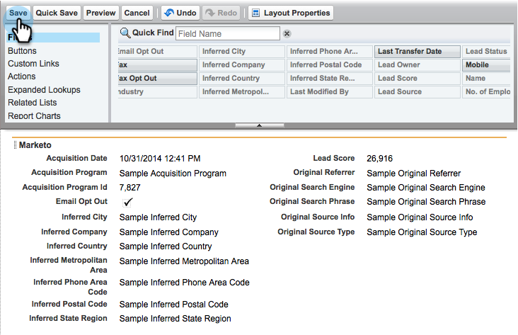

# 3단계 중 2단계:Marketing(Professional)용 Salesforce 사용자 만들기 {#step-of-create-a-salesforce-user-for-marketo-professional}

>[!NOTE]
>
>이러한 단계는 Salesforce 관리자가 완료해야 합니다.

>[!PREREQUISITES]
>
>* [3단계 중 1단계:Salesforce에 마케팅 필드 추가(Professional)](step-1-of-3-add-marketo-fields-to-salesforce-professional.md)

>

이 문서에서는 Salesforce 페이지 레이아웃을 사용하여 필드 권한을 사용자 정의하고 Marketing-Salesforce 동기화 사용자를 만듭니다.

## 페이지 레이아웃 설정 {#set-page-layouts}

Salesforce Professional은 Salesforce Enterprise/Unlimited의 프로파일과 비교하여 페이지 레이아웃을 사용하여 필드 수준의 접근성을 설정합니다. 다음 단계를 수행하면 Marketing to sync 사용자가 사용자 지정 필드를 업데이트할 수 있습니다.

1. Enter 키를 누르지 않고 탐색 검색 막대에 **페이지 레이아웃** 을 ****&#x200B;입력하고 **LeadsLeads** 아래의 **페이지 레이아웃**&#x200B;을클릭합니다.

   

1. 리드 **레이아웃** 옆에 있는 편집을 클릭합니다.

   

1. 새 **섹션을** 클릭하고 페이지 레이아웃으로 드래그합니다.

   

1. 섹션 이름에 &quot; **마케팅&quot;을** 입력하고 **확인을 클릭합니다**.

   

1. 필드 획득 날짜 **를 클릭하고 Marketing** **To** 섹션으로드래그합니다.

   

1. 다음 필드에 대해 위 단계를 반복합니다.

   * 획득 프로그램
   * 획득 프로그램 ID
   * 이메일 옵트아웃
   * 유추 도시
   * 유추 회사
   * 유추 국가
   * 유추 대도시 지역
   * 유추 전화 영역 코드
   * 유추 우편 번호
   * 유추 주 지역
   * 리드 점수
   * 원래 레퍼러
   * 원본 검색 엔진
   * 원래 검색 구문
   * 원본 소스 정보
   * 원본 소스 유형

   >[!NOTE]
   >
   >이러한 필드는 Marketing to가 해당 필드를 읽고 쓸 수 있도록 페이지 레이아웃에 있어야 합니다.

   >[!TIP]
   >
   >페이지 오른쪽으로 드래그하여 두 개의 필드 열을 만듭니다. 필드 사이의 간격을 조정하기 위해 필드를 한 쪽에서 다른 쪽으로 이동할 수 있습니다.

1. 필드 **추가가** 완료되면 저장을 클릭합니다.

   

1. Salesforce 연락처 페이지 레이아웃에 대해 위의 모든 단계를 **반복합니다**.

   

1. 연락처 페이지 레이아웃 **으로** 작업을 마치면 [ **저장]을 클릭해야 합니다**.

   

   >[!NOTE]
   >
   >**미리 알림**
   >
   >
   >[ **하루 종일 이벤트** ] 필드가 [ **이벤트 페이지 레이아웃]에 추가되었는지 확인하십시오**.

## 동기화 사용자 만들기 {#create-sync-user}

Salesforce에 액세스하려면 Marketing Cloud의 자격 증명이 필요합니다. 이 작업은 아래 단계를 통해 만든 전용 사용자에게 가장 적합합니다.

>[!NOTE]
>
>조직에 추가 Salesforce 라이선스가 없는 경우 시스템 관리자 **프로필로 기존** Marketing 사용자 **를 사용할 수** 있습니다.

1. 탐색 도구 모음에 &quot;사용자&quot;를 입력하고 [사용자 **관리]** 아래에서 **사용자**&#x200B;를클릭합니다.

   

1. 새 사용자 **를 클릭합니다**.

   

1. 필수 필드를 채우려면 **사용자 라이센스를 선택합니다.Salesforce**, **프로필 설정:시스템 관리자**, **마케팅 사용자** 를 선택하고 **저장을 클릭합니다**.

   

   >[!TIP]
   >
   >입력한 이메일 주소가 유효한지 확인합니다. 암호를 재설정하려면 동기화 사용자로 로그인해야 합니다.

훌륭해! 이제 Marketing에서 Salesforce에 연결하는 데 사용할 수 있는 계정이 있습니다. 자, 자.

>[!NOTE]
>
>**관련 문서**
>
>* [3단계 중 3단계:Connect Marketing 및 Salesforce(Professional)](step-3-of-3-connect-marketo-and-salesforce-professional.md)

>

