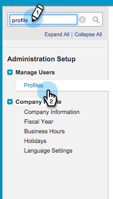

# Marketo 동기화에 기존 Salesforce 필드 추가 {#add-an-existing-salesforce-field-to-the-marketo-sync}

>[!NOTE]
>
>**관리자 권한 필요**

일반적으로 Salesforce의 새 사용자 정의 필드는 Marketo Engage에 자동으로 동기화됩니다. 그렇지 않으면 Marketo 동기화 사용자에게 필드가 표시되지 않을 수 있습니다. 이 문제를 해결하는 방법은 다음과 같습니다.

1. 이름을 클릭한 다음 **[!UICONTROL 설치]**&#x200B;를 선택합니다.

   

1. 왼쪽 검색 창에 &quot;프로필&quot;을 입력하고 **[!UICONTROL 사용자 관리]**&#x200B;에서 **[!UICONTROL 프로필]**&#x200B;을 클릭합니다.

   

1. 동기화 사용자의 프로필을 클릭합니다.

   

1. **[!UICONTROL 필드 수준 보안]** 섹션에서 필드가 있는 개체 옆에 있는 **[!UICONTROL 보기]**&#x200B;를 클릭합니다.

   

1. **[!UICONTROL 편집]**&#x200B;을 클릭합니다.

   

1. 동기화에 추가할 필드에 대한 **[!UICONTROL 표시]** 확인란을 선택하고 **[!UICONTROL 저장]**&#x200B;을 클릭합니다.

   

   다음 동기화 사이클에서 Marketo이 필드를 보고 마법을 시작합니다.

   >[!NOTE]
   >
   > 필드에 이미 Salesforce의 값이 있는 경우 해당 값은 다음 레코드 업데이트 전까지 Marketo에 동기화되지 않습니다.
