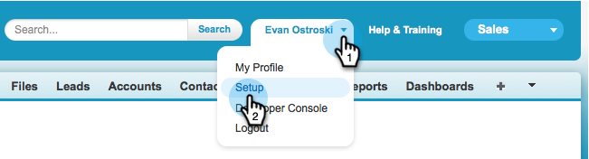

# Marketo 동기화에서 [!DNL Salesforce] 필드 숨기기 {#hide-a-salesforce-field-from-the-marketo-sync}

>[!NOTE]
>
>**관리자 권한 필요**

Salesforce의 모든 필드가 마케팅에 유용한 것은 아닙니다. 필요한 필드만 포함하여 동기화 성능을 최적화할 수 있습니다. 다음은 Marketo Engage에서 필드를 숨길 수 있는 방법입니다.

1. 이름 메뉴를 클릭하고 **[!UICONTROL Setup]**&#x200B;을(를) 선택합니다.

   

1. 검색 창에서 &quot;프로필&quot;을 입력하고 **[!UICONTROL Profiles]** 아래의 **[!UICONTROL Manage Users]**&#x200B;을(를) 클릭합니다.

   

1. 동기화 사용자의 프로필을 클릭합니다.

   

1. **[!UICONTROL Field-Level Security]** 섹션에서 대상 필드가 포함된 개체 옆의 **[!UICONTROL View]**&#x200B;을(를) 클릭합니다.

   

1. **[!UICONTROL Edit]**&#x200B;를 클릭합니다.

   

1. 숨기려는 필드 옆의 **[!UICONTROL Visible]** 확인란의 선택을 취소합니다. **[!UICONTROL Save]**&#x200B;를 클릭합니다.

   

   >[!NOTE]
   >
   >[!DNL Salesforce]에서 숨기는 필드가 이미 Marketo과 동기화된 경우 사용하지 않으려면 Marketo에서도 숨겨야 합니다.

   됐습니다. 다음 동기화가 완료되면 Marketo에서 이 필드가 더 이상 표시되지 않습니다.

   >[!MORELIKETHIS]
   >
   >[필드 숨기기 및 숨기기 취소](/help/marketo/product-docs/administration/field-management/hide-and-unhide-a-field.md){target="_blank"}
