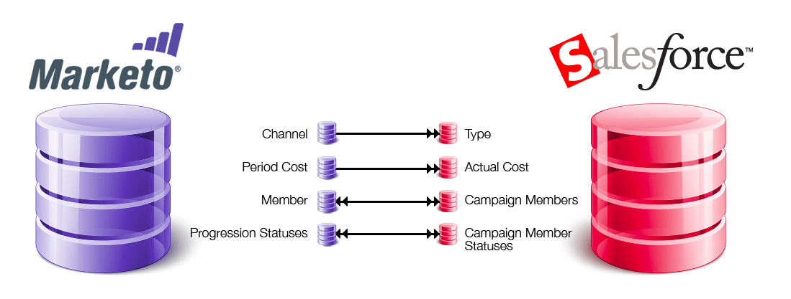

# SFDC 동기화: 캠페인 동기화 {#sfdc-sync-campaign-sync}

Marketo 프로그램은 [!DNL Salesforce] 캠페인과 동기화할 수 있습니다. 다음은 이 기능이 작동하는 방식에 대한 개요입니다.

## Marketo 프로그램을 [!DNL Salesforce] 캠페인과 동기화해야 하는 이유는 무엇입니까? {#why-should-i-sync-marketo-programs-with-salesforce-campaigns}

* Marketo 프로그램의 강력한 기능을 사용하십시오.
* Marketo 프로그램과 [!DNL Salesforce] 캠페인 간에 구성원과 상태를 동기화합니다.
* Marketo 및 [!DNL Salesforce]의 보고 기능을 탭합니다.

## Marketo 프로그램과 [!DNL Salesforce] 캠페인은 어떻게 동기화됩니까? {#how-is-a-marketo-program-and-a-salesforce-campaign-synced}

Marketo에서는 프로그램과 [!DNL Salesforce] 캠페인 간에 일대일 매핑을 만들 수 있습니다.

Marketo의 **[채널](/help/marketo/product-docs/administration/tags/create-a-program-channel.md)** 및 **[기간 비용](/help/marketo/product-docs/core-marketo-concepts/programs/working-with-programs/understanding-period-costs.md)**&#x200B;이(가) **캠페인 유형** 및 **실제 비용**(으)로 [!DNL Salesforce]에 동기화됩니다. 이 동기화는 Marketo에서 [!DNL Salesforce]&#x200B;(으)로 **단방향**&#x200B;입니다.

Marketo **프로그램 구성원** 및 **[진행 상태](/help/marketo/product-docs/core-marketo-concepts/programs/creating-programs/understanding-program-membership.md)**&#x200B;가 **[!DNL Salesforce]캠페인 구성원** 및 **캠페인 구성원 동상**&#x200B;과(와) 계속 동기화됩니다. 이 동기화는 **양방향 동기화**&#x200B;이므로 Marketo 또는 [!DNL Salesforce]에서 변경한 내용은 두 시스템에 모두 반영됩니다.

>[!NOTE]
>
>[!DNL Salesforce]에 존재하지 않는 Marketo 프로그램에 구성원이 있는 경우 Marketo은 해당 구성원을 [!DNL Salesforce]의 잠재 고객으로 만듭니다.

## 캠페인과 관련된 트리거/필터는 무엇입니까? {#what-are-the-triggers-filters-related-to-campaigns}

트리거:

* SFDC 캠페인에 추가됨
* SFDC 캠페인에서 제거됨
* SFDC Campaign에서 상태가 변경됨

필터:

* SFDC 캠페인 멤버

## SFDC 캠페인에 Marketo People 을 추가할 수 있습니까? {#can-i-add-marketo-people-to-my-sfdc-campaign}

예, [SFDC 캠페인 흐름에 추가](/help/marketo/product-docs/core-marketo-concepts/smart-campaigns/salesforce-flow-actions/add-to-sfdc-campaign.md)를 사용합니다. 이 사용자가 [!DNL Salesforce]에 없는 경우 Marketo에서 [!DNL Salesforce]에 만든 다음 해당 사용자를 캠페인에 추가합니다.

## Marketo을 사용하여 SFDC 캠페인에서 구성원을 제거할 수 있습니까? {#can-i-remove-members-from-my-sfdc-campaign-using-marketo}

예. [SFDC Campaign에서 제거](/help/marketo/product-docs/core-marketo-concepts/smart-campaigns/salesforce-flow-actions/remove-from-sfdc-campaign.md){target="_blank"}를 사용하십시오.

## Marketo을 사용하여 캠페인 멤버 상태를 변경할 수 있습니까? {#can-i-change-campaign-member-status-using-marketo}

예. [SFDC Campaign 흐름 작업에서 상태 변경](/help/marketo/product-docs/core-marketo-concepts/smart-campaigns/salesforce-flow-actions/change-status-in-sfdc-campaign.md){target="_blank"}을(를) 사용합니다.

## [!DNL Salesforce] 캠페인이 표시되지 않는 이유는 무엇입니까? {#why-cant-i-see-any-of-my-salesforce-campaigns}

확인할 수 있는 사항은 다음과 같습니다.

1. [캠페인 동기화가 활성화되었는지 확인](/help/marketo/product-docs/crm-sync/salesforce-sync/setup/optional-steps/enable-disable-campaign-sync.md).
1. [!DNL Salesforce]에서 [Marketo 동기화 사용자](/help/marketo/product-docs/crm-sync/salesforce-sync/setup/enterprise-unlimited-edition/step-2-of-3-create-a-salesforce-user-for-marketo-enterprise-unlimited.md)가 [마케팅 사용자](/help/marketo/product-docs/crm-sync/salesforce-sync/setup/optional-steps/enable-disable-campaign-sync/make-marketo-sync-user-a-marketing-user.md)인지 확인하십시오.

>[!NOTE]
>
>[!DNL Salesforce] 캠페인과 매핑된 Marketo 프로그램의 프로그램 상태가 호환되지 않는 경우 오류 메시지가 표시될 수 있습니다. 동기화 전에 [프로그램 상태를 일치시키는 것이 좋습니다](/help/marketo/product-docs/crm-sync/salesforce-sync/sfdc-sync-details/how-to-match-program-statuses-and-salesforce-campaign-statuses-prior-to-sync.md).

>[!MORELIKETHIS]
>
>* [프로그램과 SFDC Campaign 동기화](/help/marketo/product-docs/core-marketo-concepts/programs/working-with-programs/sync-an-sfdc-campaign-with-a-program.md){target="_blank"}
>* [프로그램 멤버십 이해](/help/marketo/product-docs/core-marketo-concepts/programs/creating-programs/understanding-program-membership.md){target="_blank"}
>* [Campaign 동기화 활성화/비활성화](/help/marketo/product-docs/crm-sync/salesforce-sync/setup/optional-steps/enable-disable-campaign-sync.md){target="_blank"}
>* [Marketo 동기화 사용자를 마케팅 사용자로 설정](/help/marketo/product-docs/crm-sync/salesforce-sync/setup/optional-steps/enable-disable-campaign-sync/make-marketo-sync-user-a-marketing-user.md){target="_blank"}
