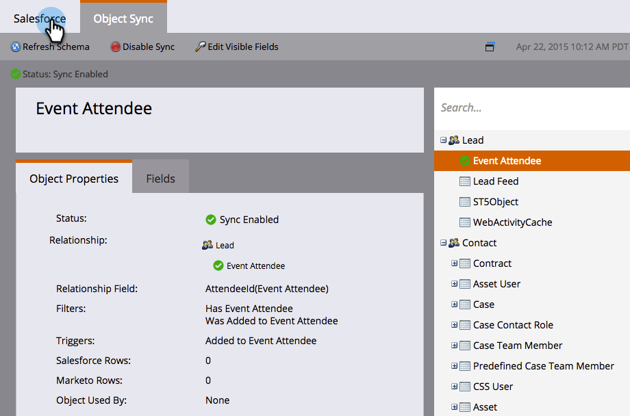

# SFDC 동기화:사용자 지정 개체 동기화 {#sfdc-sync-custom-object-sync}

Salesforce 인스턴스에서 만든 사용자 정의 개체는 Marketing To의 일부일 수 있습니다.  설정 방법

>[!NOTE]
>
>**관리자 권한 필요**

>[!PREREQUISITES]
>
>사용자 지정 개체를 사용하려면 Salesforce의 [리드](/help/marketo/product-docs/crm-sync/salesforce-sync/sfdc-sync-details/sfdc-sync-field-sync.md), [연락처](/help/marketo/product-docs/crm-sync/salesforce-sync/sfdc-sync-details/sfdc-sync-contact-sync.md) 또는 [계정](/help/marketo/product-docs/crm-sync/salesforce-sync/sfdc-sync-details/sfdc-sync-account-sync.md) 개체에 연결해야 합니다.

## 사용자 지정 개체 사용 {#enable-custom-object}

1. **관리** 및 **Salesforce 개체 동기화** 링크를 클릭합니다.

   .

1. 첫 번째 사용자 지정 개체인 경우 **스키마 동기화**&#x200B;를 클릭합니다.

   

1. **전역 동기화 비활성화**&#x200B;를 클릭합니다.

   

   >[!NOTE]
   >
   >Salesforce 사용자 지정 개체 스키마의 초기 동기화를 완료하는 데 몇 분 정도 걸릴 수 있습니다.

   

1. 동기화할 사용자 정의 개체를 캔버스로 드래그합니다.

   

   >[!NOTE]
   >
   >사용자 지정 객체에는 고유한 이름이 있어야 합니다. Marketing에서는 이름이 같은 서로 다른 두 사용자 지정 개체를 지원하지 않습니다.

1. **동기화 활성화**&#x200B;를 클릭합니다.

   

1. **동기화 사용**&#x200B;을 다시 클릭합니다.

   

   >[!NOTE]
   >
   >전역 동기화를 다시 활성화하는 것을 잊지 마십시오!

1. **Salesforce** 탭으로 돌아갑니다.

   

1. **동기화 활성화**&#x200B;를 클릭합니다.

   

1. 모든 Salesforce 사용자 지정 개체를 보려면 **관리** 및 **Salesforce 개체 동기화** 링크(위의 1단계와 동일)를 클릭합니다.

   

   >[!NOTE]
   >
   >Marketing은 하나 또는 두 수준 깊이 표준 엔티티에 연결된 사용자 지정 엔티티만 지원합니다.

### 다음 기능:{#whats-next}

[사용자 지정 개체 필드를 스마트 목록/트리거 제약 조건으로 추가/제거](/help/marketo/product-docs/crm-sync/salesforce-sync/setup/optional-steps/add-remove-custom-object-field-as-smart-list-trigger-constraints.md)

훌륭해! 이제 스마트 캠페인 및 스마트 목록에서 이 사용자 지정 개체의 데이터를 사용할 수 있습니다.
