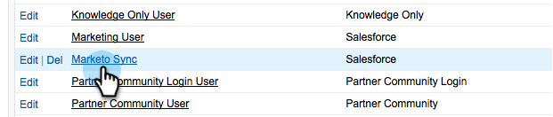

# Marketing To Sync에서 Salesforce 필드 숨기기 {#hide-a-salesforce-field-from-the-marketo-sync}

>[!NOTE]
>
>**관리자 권한 필요**

Salesforce의 모든 필드가 마케팅에 유용한 것은 아닙니다. 필요한 필드만 포함하여 동기화 성능을 최적화할 수 있습니다. Marketing To에서 필드를 숨기는 방법을 설명합니다.

1. 이름 메뉴를 클릭하고 **설정을 선택합니다**.

   

1. 검색 막대에 **프로필** 을 입력하고 사용자 **관리** 아래에 있는 **프로필을**&#x200B;클릭합니다.

   

1. 동기화 사용자의 프로필을 클릭합니다.

   

1. 필드 **수준 보안** 섹션 아래에서 대상 필드가 포함된 개체 **옆의** 보기를클릭합니다.

   

1. 편집을 **클릭합니다**.

   

1. 숨길 필드 **옆의** 표시 확인란을 선택 취소합니다. 저장을 **클릭합니다**.

   

   >[!NOTE]
   >
   >Salesforce에서 숨긴 필드가 Marketing To와 이미 동기화된 경우 사용하지 않으려면 Marketing To에서도 숨겨야 합니다.

   바로 그거야! 다음 동기화가 완료된 후 Marketing To에서 이 필드가 더 이상 표시되지 않습니다.

   >[!NOTE]
   >
   >**관련 문서**
   >
   >    
   >    
   >    * [필드 숨기기 및 숨김 취소](../../../../../product-docs/administration/field-management/hide-and-unhide-a-field.md)

