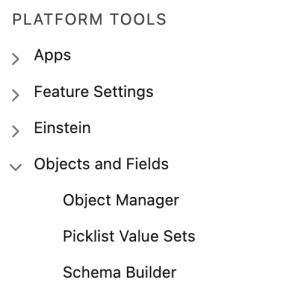

# 1/3단계: Veeva CRM에 Marketo 필드 추가 {#step-1-of-3-add-marketo-fields-to-veeva-crm}

>[!PREREQUISITES]
>
>Veeva CRM 인스턴스는 Marketo Engage과 Veeva CRM 간에 데이터를 동기화하려면 Salesforce API에 액세스할 수 있어야 합니다.

Marketo Engage은 일련의 필드를 사용하여 특정 종류의 마케팅 관련 정보를 캡처합니다. 이 데이터를 Veeva CRM에 포함하려면 아래 지침을 따르십시오.

`1.` 연락처 개체의 Veeva CRM에서 사용자 지정 필드를 만듭니다. 점수

`2.` 원하는 경우 추가 필드를 만들 수 있습니다(아래 표 참조).

이러한 모든 사용자 정의 필드는 선택 사항이며 Marketo Engage 및 Veeva CRM을 동기화하는 데 필요하지 않습니다.

## Veeva CRM에 Marketo 필드 추가 {#add-marketo-fields-to-veeva-crm}

위에 나열된 Veeva CRM의 리드 및 연락처 개체에 사용자 지정 필드를 추가합니다. 더 추가하려면 이 섹션의 끝에 있는 사용 가능한 필드 표를 참조하십시오.

점수 필드에 대해 다음 단계를 수행하여 추가합니다.

1. Veeva CRM에 로그인하고 **[!UICONTROL 설정]**.

   

1. 클릭 **[!UICONTROL 오브젝트 및 필드]** 및 선택 **[!UICONTROL 오브젝트 관리자]**.

   

1. 검색 창에서 &quot;Contact&quot;를 검색합니다.

   

1. 다음을 클릭합니다. **[!UICONTROL 연락처]** 개체.

1. 선택 **[!UICONTROL 필드 및 관계]**.

1. 클릭 **[!UICONTROL 신규]**.

   

1. 적절한 필드 유형을 선택합니다(점수 - 숫자의 경우).

   

1. **[!UICONTROL 다음]**&#x200B;을 클릭합니다.

   

1. 다음을 입력합니다. **[!UICONTROL 필드 레이블]**, **[!UICONTROL Length]**, 및 **[!UICONTROL 필드 이름]** (아래 표에 표시된 대로) 필드를 선택합니다.

<table>
 <tbody>
  <tr>
   <th>필드 레이블
   <th>필드 이름
   <th>데이터 유형
   <th>필드 속성
  </tr>
  <tr>
   <td>스코어</td>
   <td>mkto71_Lead_Score</td>
   <td>숫자</td>
   <td>길이 10 
소수점 이하 자리 수 0</td>
  </tr>
 </tbody>
</table>

>[!NOTE]
>
>Veeva CRM은 __c를 사용하여 API 이름을 만들 때 필드 이름에 추가합니다.

>[!NOTE]
>
>텍스트 및 숫자 필드는 길이가 필요하지만 날짜/시간 필드는 길이가 필요하지 않습니다. 설명은 선택 사항입니다.

1. **[!UICONTROL 다음]**&#x200B;을 클릭합니다.

   

1. 액세스 설정을 지정하고 **[!UICONTROL 다음]**.

1. 모든 역할을 표시 및 읽기 전용으로 설정합니다.

1. 동기화 사용자의 프로필에 대한 읽기 전용 확인란의 선택을 취소합니다.

* 시스템 관리자 프로필을 동기화 사용자로 가진 사용자가 있는 경우 시스템 관리자 프로필에 대한 읽기 전용 확인란의 선택을 취소합니다(아래 참조).
* 동기화 사용자에 대한 사용자 지정 프로필을 만든 경우 해당 사용자 지정 프로필에 대한 읽기 전용 확인란의 선택을 취소합니다.

  

1. 필드를 표시할 페이지 레이아웃을 선택합니다.

1. 클릭 **[!UICONTROL 저장 및 새로 만들기]** 로 돌아가서 다른 두 개의 사용자 정의 필드를 각각 만듭니다.

1. 클릭 **[!UICONTROL 저장]** 세 가지를 다 끝내면

   

>[!NOTE]
>
>연락처 개체에 필드를 추가하면 개인 계정 개체에도 추가됩니다.

선택 사항: 아래 표의 추가 사용자 정의 필드에 대해 위의 절차를 사용하십시오.

<table>
 <tbody>
  <tr>
   <th>필드 레이블
   <th>필드 이름
   <th>데이터 유형
   <th>필드 속성
  </tr>
  <tr>
   <td>추론된 시</td>
   <td>mkto71_Inferred_City</td>
   <td>텍스트</td>
   <td>길이 255</td>
  </tr>
  <tr>
   <td>추론된 회사</td>
   <td>mkto71_Inferred_Company</td>
   <td>텍스트</td>
   <td>길이 255</td>
  </tr>
  <tr>
   <td>추론된 국가</td>
   <td>mkto71_Inferred_Country</td>
   <td>텍스트</td>
   <td>길이 255</td>
  </tr>
  <tr>
   <td>대도시 지역 유추</td>
   <td>mkto71_Inferred_Metropolitan_Area</td>
   <td>텍스트</td>
   <td>길이 255</td>
  </tr>
  <tr>
   <td>전화번호 지역코드 유추</td>
   <td>mkto71_Inferred_Phone_Area_Code</td>
   <td>텍스트</td>
   <td>길이 255</td>
  </tr>
  <tr>
   <td>추론된 우편번호</td>
   <td>mkto71_Inferred_Postal_Code</td>
   <td>텍스트</td>
   <td>길이 255</td>
  </tr>
  <tr>
   <td>유추된 주 지역</td>
   <td>mkto71_Inferred_State_Region</td>
   <td>텍스트</td>
   <td>길이 255</td>
  </tr>
 </tbody>
</table>

>[!NOTE]
>
>새 필드를 만들 때 Marketo에서 자동으로 할당한 필드의 값을 Veeva CRM에서 즉시 사용할 수 없습니다. Marketo은 다음 업데이트 시 두 시스템의 레코드에 데이터를 Veeva CRM에 동기화합니다(즉, Marketo과 Veeva CRM 간에 동기화되는 모든 필드에 대한 업데이트).
