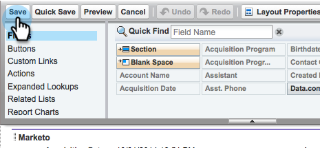

# 2단계/3단계: Marketo Engage용 [!DNL Veeva] CRM 사용자 만들기 {#step-2-of-3-create-a-veeva-crm-user-for-marketo-engage}

>[!NOTE]
>
>이 문서의 단계는 [!DNL Veeva] CRM 관리자가 완료해야 합니다.

>[!PREREQUISITES]
>
>[3단계 중 1단계:  [!DNL Salesforce] (Professional)에 Marketo 필드 추가](/help/marketo/product-docs/crm-sync/veeva-crm-sync/setup/step-1-of-3-add-marketo-fields-to-veeva-crm.md){target="_blank"}

이 문서에서는 [!DNL Veeva] CRM 페이지 레이아웃으로 필드 권한을 사용자 지정하고 [!DNL Marketo-Veeva] CRM 동기화 사용자를 만듭니다.

## 페이지 레이아웃 설정 {#set-page-layouts}

이 단계를 수행하면 Marketo 동기화 사용자가 사용자 정의 필드를 업데이트할 수 있습니다.

1. Enter 키를 누르지 않고 탐색 검색 막대에서 **[!UICONTROL Account]**(개인 계정) 페이지 레이아웃을 클릭하고 **[!UICONTROL Page Layout]** 아래의 [!UICONTROL Contacts]을(를) 클릭합니다.

   

1. **[!UICONTROL Page Layouts]**&#x200B;을(를) 클릭합니다.

   

1. **[!UICONTROL HCP - Professional]**&#x200B;을(를) 클릭합니다.

   

1. 새 **[!UICONTROL Section]**&#x200B;을(를) 클릭하여 페이지 레이아웃으로 끕니다.

1. **[!UICONTROL Section Name]**&#x200B;에 대해 &quot;Marketo&quot;를 입력하고 **[!UICONTROL OK]**&#x200B;을(를) 클릭합니다.

   

1. **[!UICONTROL Score]** 필드를 클릭하여 Marketo 섹션으로 끌어옵니다.

   

1. 다음 필드에 대해 위의 단계를 반복합니다.

   * 추론된 시
   * 추론된 회사
   * 추론된 국가
   * 대도시 지역 유추
   * 전화번호 지역코드 유추
   * 추론된 우편번호
   * 유추된 주 지역

   >[!NOTE]
   >
   >Marketo에서 필드를 읽고 쓸 수 있도록 이러한 필드는 페이지 레이아웃에 있어야 합니다.

   >[!TIP]
   >
   >페이지의 오른쪽으로 끌어 놓아 필드에 대한 두 개의 열을 만듭니다. 열 길이의 균형을 맞추기 위해 필드를 한 쪽에서 다른 쪽으로 이동할 수 있습니다.

1. [!UICONTROL HCP-Professional] 레이아웃이 완료되면 **[!UICONTROL Save]**&#x200B;을(를) 클릭합니다.

   

>[!NOTE]
>
>다른 [!UICONTROL Account] 페이지 레이아웃에 대해 이 작업을 반복합니다.

## 프로필 만들기 {#create-a-profile}

1. **[!UICONTROL Setup]**&#x200B;을(를) 클릭합니다.

   

1. 탐색 검색 창에 &quot;profiles&quot;를 입력하고 **[!UICONTROL Profiles]** 링크를 클릭합니다.

   

1. **[!UICONTROL New]**&#x200B;을(를) 클릭합니다.

   

1. **[!UICONTROL Standard User]**&#x200B;을(를) 선택하고 프로필 이름을 &quot;[!UICONTROL Marketo-Salesforce Sync]&quot;로 지정한 다음 **[!UICONTROL Save]**&#x200B;을(를) 클릭합니다.

   

## 프로필 권한 설정 {#set-profile-permissions}

1. 보안 권한을 설정하려면 **[!UICONTROL Edit]**&#x200B;을(를) 클릭하십시오.

   

1. [!UICONTROL Administrative Permissions] 섹션에서 [!UICONTROL API Enabled]이(가) 선택되어 있는지 확인하십시오.

   

   >[!TIP]
   >
   >[!UICONTROL Password Never Expires] 상자를 확인하십시오.

1. [!UICONTROL General User Permissions] 섹션에서 [!UICONTROL Edit Events] 및 [!UICONTROL Edit Tasks]이(가) 선택되어 있는지 확인하십시오.

   

1. [!UICONTROL Standard Object Permissions] 섹션에서 [!UICONTROL Read] 및 [!UICONTROL Create]에 대해 [!UICONTROL Edit], [!UICONTROL Delete], [!UICONTROL Accounts] 및 [!UICONTROL Contacts] 권한을 검사했는지 확인하십시오.

   

1. [!UICONTROL Custom Object Permissions] 섹션에서 [!UICONTROL Read], [!UICONTROL Call] 및 기타 원하는 사용자 지정 개체에 대해 [!UICONTROL Call Key Message] 권한을 검사했는지 확인하십시오.

   

1. 완료되면 페이지 하단의 **[!UICONTROL Save]**&#x200B;을(를) 클릭합니다.

   

## 필드 권한 설정 {#set-field-permissions}

1. 동기화에 필요한 사용자 지정 필드를 확인하려면 마케터와 상의하십시오.

   >[!NOTE]
   >
   >이 단계는 Marketo에 필요하지 않은 필드가 표시되지 않도록 하여 혼란을 줄이고 동기화 속도를 높입니다.

1. [!UICONTROL profile detail] 페이지에서 **[!UICONTROL Field-Level Security]** 섹션으로 이동합니다. **[!UICONTROL View]** 및 [!UICONTROL Contact] 개체에 대한 액세스 가능성을 편집하려면 [!UICONTROL Account]을(를) 클릭하십시오.

   

   >[!TIP]
   >
   >조직의 필요에 따라 다른 객체를 구성할 수 있습니다.

1. 각 개체에 대해 **[!UICONTROL Edit]**&#x200B;을(를) 클릭합니다.

   

불필요한 필드를 찾아 [!UICONTROL Read Access] 및 [!UICONTROL Edit Access]이(가) **실행 취소**&#x200B;되어 있는지 확인하십시오. 완료되면 **[!UICONTROL Save]**&#x200B;을(를) 클릭합니다.

>[!NOTE]
>
>사용자 정의 필드에 대한 액세스 가능성만 편집하십시오.

1. 모든 불필요한 필드를 비활성화한 후 다음 개체 필드에 대해 [!UICONTROL Read Access] 및 [!UICONTROL Edit Access]을(를) 확인하십시오. 완료되면 **[!UICONTROL Save]**&#x200B;을(를) 클릭합니다.

<table>
 <tbody>
  <tr>
   <th>오브젝트
   <th>필드
  </tr>
  <tr>
   <td>계정</td>
   <td>필드 입력</td>
  </tr>
  <tr>
   <td>이벤트</td>
   <td>모든 필드</td>
  </tr>
  <tr>
   <td>작업</td>
   <td>모든 필드</td>
  </tr>
 </tbody>
</table>

## 동기화 사용자 만들기 {#create-sync-user}

Marketo에서 [!DNL Veeva] CRM에 액세스하려면 자격 증명이 필요합니다. 이 작업은 아래 단계로 만든 전용 사용자로 수행하는 것이 가장 좋습니다.

>[!NOTE]
>
>조직에 추가 [!DNL Veeva] CRM 라이선스가 없는 경우 시스템 관리자 프로필로 기존 마케팅 사용자를 사용할 수 있습니다.

1. 탐색 검색 창에 &quot;사용자&quot;를 입력하고 **[!UICONTROL Users]** 아래의 [!UICONTROL Manage Users]을(를) 클릭합니다.

   

1. **[!UICONTROL New User]**&#x200B;을(를) 클릭합니다.

   

1. 필수 필드를 입력하고 **[!UICONTROL User License]**: **[!UICONTROL Salesforce]**&#x200B;을(를) 선택한 다음 **[!UICONTROL Profile]**: **[!UICONTROL Marketo Sync]** 사용자를 설정하고 **[!UICONTROL Save]**&#x200B;을(를) 클릭합니다.

   

>[!TIP]
>
>입력한 이메일 주소가 유효한지 확인하십시오. 암호를 재설정하려면 동기화 사용자로 로그인해야 합니다.

훌륭합니다! 이제 Marketo Engage에서 [!DNL Veeva] CRM에 연결하는 데 사용할 수 있는 계정이 있습니다. 그렇게 합시다.

>[!MORELIKETHIS]
>
>[3단계 중 3단계: Marketo 및 [!DNL Veeva] CRM](/help/marketo/product-docs/crm-sync/veeva-crm-sync/setup/step-3-of-3-connect-marketo-engage-and-veeva-crm.md){target="_blank"} 연결
