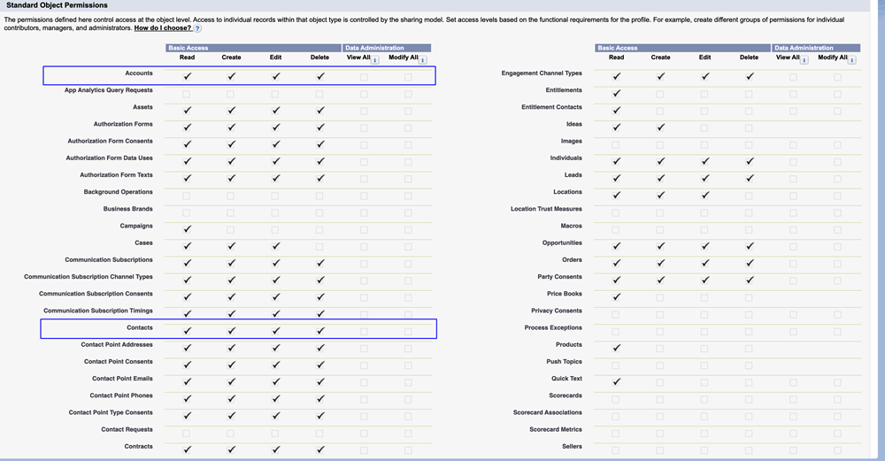

# 2/3단계: Marketo Engage을 위한 Veeva CRM 사용자 만들기 {#step-2-of-3-create-a-veeva-crm-user-for-marketo-engage}

>[!NOTE]
>
>이 문서의 단계는 Veeva CRM 관리자가 완료해야 합니다.

>[!PREREQUISITES]
>
>[3단계 중 1단계: Salesforce(Professional)에 Marketo 필드 추가](/help/marketo/product-docs/crm-sync/veeva-crm-sync/setup/step-1-of-3-add-marketo-fields-to-veeva-crm.md){target="_blank"}

이 문서에서는 Veeva CRM 페이지 레이아웃으로 필드 권한을 사용자 지정하고 Marketo-Veeva CRM 동기화 사용자를 만듭니다.

## 페이지 레이아웃 설정 {#set-page-layouts}

이 단계를 수행하면 Marketo 동기화 사용자가 사용자 정의 필드를 업데이트할 수 있습니다.

1. Enter 키를 누르지 않고 탐색 검색 창에서 계정(개인 계정) 페이지 레이아웃을 클릭하고 연락처 아래의 **[!UICONTROL 페이지 레이아웃]**&#x200B;을 클릭합니다.

   

1. **[!UICONTROL 페이지 레이아웃]**&#x200B;을 클릭합니다.

   

1. **[!UICONTROL HCP - 전문가]**&#x200B;를 클릭합니다.

   

1. 새 **[!UICONTROL 섹션]**&#x200B;을(를) 클릭하여 페이지 레이아웃으로 끌어서 놓습니다.

1. 섹션 이름에 &quot;Marketo&quot;를 입력하고 **[!UICONTROL 확인]**&#x200B;을 클릭합니다.

   

1. 점수 필드를 클릭하여 Marketo 섹션으로 드래그합니다.

   

1. 다음 필드에 대해 위의 단계를 반복합니다.

   * 추론된 시
   * 추론된 회사
   * 추론된 국가
   * 대도시 지역 유추
   * 전화번호 지역코드 유추
   * 추론된 우편번호
   * 유추된 주 지역

   >[!NOTE]
   >
   >Marketo에서 필드를 읽고 쓸 수 있도록 이러한 필드는 페이지 레이아웃에 있어야 합니다.

   >[!TIP]
   >
   >페이지의 오른쪽으로 끌어 놓아 필드에 대한 두 개의 열을 만듭니다. 열 길이의 균형을 맞추기 위해 필드를 한 쪽에서 다른 쪽으로 이동할 수 있습니다.

1. HCP-Professional 레이아웃이 완료되면 **[!UICONTROL 저장]**&#x200B;을 클릭하세요.

   

   >[!NOTE]
   >
   >다른 계정 페이지 레이아웃에 대해 이 단계를 반복합니다.

## 프로필 만들기 {#create-a-profile}

1. **[!UICONTROL 설치]**&#x200B;를 클릭합니다.

   

1. 탐색 창 검색 창에 &quot;profiles&quot;를 입력하고 **[!UICONTROL Profiles]** 링크를 클릭합니다.

   

1. **[!UICONTROL 새로 만들기]**&#x200B;를 클릭합니다.

   

1. 표준 사용자를 선택하고 프로필 이름을 &quot;Marketo-Salesforce Sync&quot;로 지정한 다음 **[!UICONTROL 저장]**&#x200B;을 클릭합니다.

   

## 프로필 권한 설정 {#set-profile-permissions}

1. 보안 권한을 설정하려면 **[!UICONTROL 편집]**&#x200B;을 클릭하세요.

   

1. 관리 권한 섹션에서 **[!UICONTROL API 사용]**&#x200B;을(를) 선택했는지 확인하십시오.

   

   >[!TIP]
   >
   >암호 만료 안 함 상자를 선택해야 합니다.

1. 일반 사용자 권한 섹션에서 **[!UICONTROL 이벤트 편집]** 및 **[!UICONTROL 작업 편집]**&#x200B;을(를) 선택했는지 확인하십시오.

   

1. 표준 개체 권한 섹션에서 계정 및 연락처에 대해 **[!UICONTROL 읽기]**, **[!UICONTROL 만들기]**, **[!UICONTROL 편집]** 및 **[!UICONTROL 삭제]** 권한을 검사했는지 확인하십시오.

   

1. 사용자 지정 개체 권한 섹션에서 **[!UICONTROL 호출]**, **[!UICONTROL 호출 키 메시지]** 및 기타 원하는 사용자 지정 개체에 대한 읽기 권한을 검사했는지 확인하십시오.

   

1. 완료되면 페이지 하단의 **[!UICONTROL 저장]**&#x200B;을 클릭합니다.

   

## 필드 권한 설정 {#set-field-permissions}

1. 동기화에 필요한 사용자 지정 필드를 확인하려면 마케터와 상의하십시오.

   >[!NOTE]
   >
   >이 단계는 Marketo에 필요하지 않은 필드가 표시되지 않도록 하여 혼란을 줄이고 동기화 속도를 높입니다.

1. 프로필 세부 정보 페이지에서 [!UICONTROL 필드 수준 보안] 섹션으로 이동합니다. 연락처 및 계정 개체에 대한 액세스 가능성을 편집하려면 **[!UICONTROL 보기]**&#x200B;를 클릭하세요.

   

   >[!TIP]
   >
   >조직의 필요에 따라 다른 객체를 구성할 수 있습니다.

1. 각 개체에 대해 **[!UICONTROL 편집]**&#x200B;을 클릭합니다.

   

1. 불필요한 필드를 찾고 액세스 읽기 및 액세스 권한 편집이 _선택 취소됨_&#x200B;인지 확인하십시오. 완료되면 **[!UICONTROL 저장]**&#x200B;을 클릭합니다.

   

   >[!NOTE]
   >
   >사용자 정의 필드에 대한 액세스 가능성만 편집하십시오.

1. 모든 불필요한 필드 비활성화를 완료한 후 다음 개체 필드에 대해 읽기 액세스 및 액세스 편집 을 선택합니다. 완료되면 **[!UICONTROL 저장]**&#x200B;을 클릭합니다.

<table>
 <tbody>
  <tr>
   <th>오브젝트
   <th>필드
  </tr>
  <tr>
   <td>계정</td>
   <td>필드 입력</td>
  </tr>
  <tr>
   <td>이벤트</td>
   <td>모든 필드</td>
  </tr>
  <tr>
   <td>작업</td>
   <td>모든 필드</td>
  </tr>
 </tbody>
</table>

## 동기화 사용자 만들기 {#create-sync-user}

Marketo에서 Veeva CRM에 액세스하려면 자격 증명이 필요합니다. 이 작업은 아래 단계로 만든 전용 사용자로 수행하는 것이 가장 좋습니다.

>[!NOTE]
>
>조직에 추가 Veeva CRM 라이센스가 없는 경우 시스템 관리자 프로필로 기존 마케팅 사용자를 사용할 수 있습니다.

1. 탐색 검색 창에 &quot;사용자&quot;를 입력하고 사용자 관리 아래의 **[!UICONTROL 사용자]**&#x200B;를 클릭합니다.

   

1. **[!UICONTROL 새 사용자]**&#x200B;를 클릭합니다.

   

1. 필수 필드를 입력하고 사용자 라이선스: Salesforce를 선택하고 프로필: Marketo 동기화 사용자를 설정한 다음 **[!UICONTROL 저장]**&#x200B;을 클릭합니다.

   

>[!TIP]
>
>입력한 이메일 주소가 유효한지 확인하십시오. 암호를 재설정하려면 동기화 사용자로 로그인해야 합니다.

훌륭합니다! 이제 Marketo Engage이 Veeva CRM에 연결하는 데 사용할 수 있는 계정이 생겼습니다. 해보자.

>[!MORELIKETHIS]
>
>[3단계 중 3단계: Marketo 및 Veeva CRM 연결](/help/marketo/product-docs/crm-sync/veeva-crm-sync/setup/step-3-of-3-connect-marketo-engage-and-veeva-crm.md){target="_blank"}
