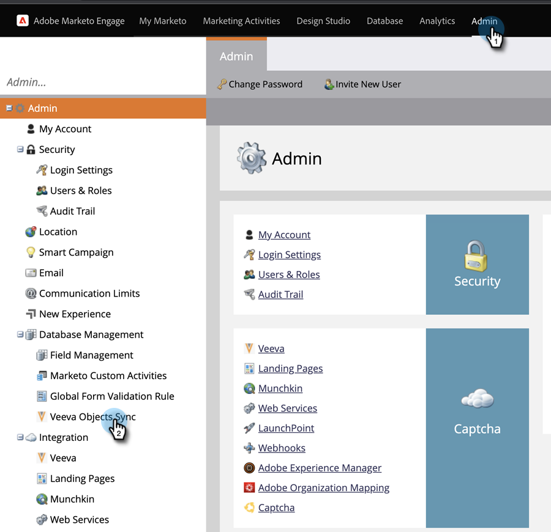

# 사용자 지정 개체 동기화 {#custom-object-sync}

[!DNL Veeva] CRM 인스턴스에서 만든 사용자 지정 개체도 Marketo Engage의 일부일 수 있습니다. 설정 방법은 다음과 같습니다.

>[!NOTE]
>
>**관리자 권한 필요**

>[!PREREQUISITES]
>
>사용자 지정 개체를 사용하려면 [!DNL Veeva] CRM의 연락처 또는 계정 개체에 연결해야 합니다.

## 사용자 지정 개체 사용 {#enable-custom-object}

1. Marketo에서 **[!UICONTROL Admin]**&#x200B;을(를) 클릭한 다음 **[!UICONTROL Veeva Objects Sync]**&#x200B;을(를) 클릭합니다.

   

1. 첫 번째 사용자 지정 개체인 경우 **[!UICONTROL Sync Schema]**&#x200B;을(를) 클릭합니다.

   

1. **[!UICONTROL Disable Global Sync]**&#x200B;을(를) 클릭합니다.

   

   >[!NOTE]
   >
   >[!DNL Veeva] 사용자 지정 개체 스키마의 초기 동기화는 몇 분 정도 걸릴 수 있습니다.

1. 동기화하려는 사용자 지정 개체를 캔버스로 드래그합니다.

   

   >[!NOTE]
   >
   >사용자 지정 개체에는 고유한 이름이 있어야 합니다. Marketo은 이름이 같은 두 개의 서로 다른 사용자 지정 개체를 지원하지 않습니다.

1. **[!UICONTROL Enable Sync]**&#x200B;을(를) 클릭합니다.

   

1. **[!UICONTROL Enable Sync]**&#x200B;을(를) 다시 클릭합니다.

   

1. **[!UICONTROL Veeva]** 탭으로 돌아갑니다.

   

1. **[!UICONTROL Enable Sync]**&#x200B;을(를) 클릭합니다.

   

1. [!DNL Veeva] 사용자 지정 개체를 모두 보려면 **[!UICONTROL Admin]** 및 **[!UICONTROL Veeva Objects Sync]**&#x200B;을(를) 클릭하십시오.

   

   >[!NOTE]
   >
   >Marketo은 1~2단계 수준의 표준 엔티티에 연결된 사용자 지정 엔티티만 지원합니다.

훌륭합니다! 이제 스마트 캠페인 및 스마트 목록에서 이 사용자 지정 개체의 데이터를 사용할 수 있습니다.

>[!MORELIKETHIS]
>
>* [통화 및 통화 키 메시지 동기화](/help/marketo/product-docs/crm-sync/veeva-crm-sync/sync-details/syncing-call-and-call-key-messages.md){target="_blank"}
>* [사용자 지정 개체 필드를 스마트 목록/트리거 제약 조건으로 추가/제거](/help/marketo/product-docs/crm-sync/veeva-crm-sync/sync-details/add-remove-custom-object-field-as-smart-list-trigger-constraints.md){target="_blank"}
