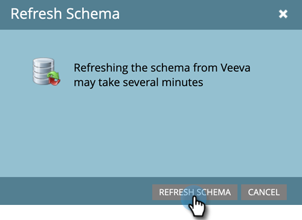

# 사용자 지정 개체 동기화 활성화/비활성화 {#enable-disable-custom-object-sync}

Veeva CRM 인스턴스에서 만든 사용자 지정 개체도 Marketo Engage의 일부가 될 수 있습니다. 설정 방법은 다음과 같습니다.

## 사용자 지정 개체 동기화 활성화 또는 비활성화 {#enable-or-disable-the-custom-object-sync}

>[!NOTE]
>
>**관리자 권한 필요**

1. Marketo에서 **[!UICONTROL 관리자]**, 그런 다음 **[!UICONTROL Veeva 개체 동기화]**.

   

1. 첫 번째 사용자 지정 개체인 경우 스키마 동기화를 클릭합니다. 그렇지 않은 경우 **[!UICONTROL 스키마 새로 고침]** 최신 버전을 확인합니다.

   

1. 전역 동기화가 실행 중인 경우 다음을 클릭하여 비활성화합니다. **[!UICONTROL 전역 동기화 비활성화]**.

   

   >[!NOTE]
   >
   >Veeva 사용자 지정 개체 스키마의 동기화는 몇 분 정도 걸릴 수 있습니다.

1. 클릭 **[!UICONTROL 스키마 새로 고침]**.

   

동기화할 개체를 선택하고 동기화 활성화를 클릭합니다.

>[!TIP]
>
>Marketo은 사용자 지정 개체가 Veeva CRM의 연락처 또는 계정 개체와 직접 관련이 있는 경우에만 동기화할 수 있습니다.

1. 클릭 **[!UICONTROL 동기화 활성화]** 다시.

   

1. Veeva 탭으로 돌아가서 를 클릭합니다. **[!UICONTROL 동기화 활성화]**.

   

## 사용자 지정 개체 사용 {#using-your-custom-objects}

>[!NOTE]
>
>트리거가 있는 스마트 캠페인에서는 사용자 지정 개체를 사용할 수 없습니다.

1. 스마트 목록에서 &quot;Has Opportunity&quot; 필터 위로 끌어서 다음으로 설정합니다. **[!UICONTROL True]**.

   

1. 필요한 경우 필터 제한을 사용하여 포커스를 좁힐 수 있습니다.

   

훌륭합니다! 이제 스마트 캠페인 및 스마트 목록에서 이 사용자 지정 개체의 데이터를 사용할 수 있습니다.

>[!MORELIKETHIS]
>
>[사용자 지정 개체 필드를 스마트 목록/트리거 제한으로 추가/제거](/help/marketo/product-docs/crm-sync/veeva-crm-sync/sync-details/add-remove-custom-object-field-as-smart-list-trigger-constraints.md){target="_blank"}
