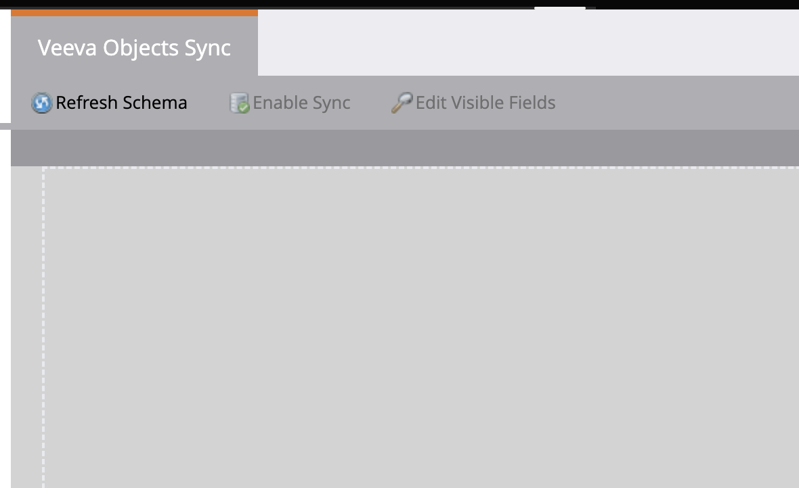

# 사용자 지정 개체 동기화 활성화/비활성화 {#enable-disable-custom-object-sync}

[!DNL Veeva] CRM 인스턴스에서 만든 사용자 지정 개체도 Marketo Engage의 일부일 수 있습니다. 다음은 설정하는 방법입니다.

## 사용자 지정 개체 동기화 활성화 또는 비활성화 {#enable-or-disable-the-custom-object-sync}

>[!NOTE]
>
>**관리자 권한 필요**

1. Marketo에서 **[!UICONTROL Admin]**&#x200B;을(를) 클릭한 다음 **[!UICONTROL Veeva Objects Sync]**&#x200B;을(를) 클릭합니다.

   

1. 첫 번째 사용자 지정 개체인 경우 **[!UICONTROL Sync Schema]**&#x200B;을(를) 클릭합니다. 그렇지 않은 경우 **[!UICONTROL Refresh Schema]**&#x200B;을(를) 클릭하여 최신 버전이 있는지 확인하십시오.

   

1. 전역 동기화가 실행 중인 경우 **[!UICONTROL Disable Global Sync]**&#x200B;을(를) 클릭하여 사용하지 않도록 설정합니다.

   

   >[!NOTE]
   >
   >[!DNL Veeva] 사용자 지정 개체 스키마의 동기화에 몇 분 정도 걸릴 수 있습니다.

1. **[!UICONTROL Refresh Schema]**&#x200B;을(를) 클릭합니다.

   

동기화할 개체를 선택하고 **[!UICONTROL Enable Sync]**&#x200B;을(를) 클릭합니다.

>[!TIP]
>
>Marketo은 사용자 지정 개체가 [!DNL Veeva] CRM의 연락처 또는 계정 개체와 직접 관련이 있는 경우에만 동기화할 수 있습니다.

1. **[!UICONTROL Enable Sync]**&#x200B;을(를) 다시 클릭합니다.

   

1. [!UICONTROL Veeva] 탭으로 돌아가서 **[!UICONTROL Enable Sync]**&#x200B;을(를) 클릭합니다.

   

## 사용자 지정 개체 사용 {#using-your-custom-objects}

>[!NOTE]
>
>트리거가 있는 스마트 캠페인에서는 사용자 지정 개체를 사용할 수 없습니다.

1. [!UICONTROL Smart List]에서 &quot;**[!UICONTROL Has Opportunity]**&quot; 필터 위로 끌어서 **[!UICONTROL True]**(으)로 설정합니다.

   

1. 필요한 경우 필터 제한을 사용하여 포커스를 좁힐 수 있습니다.

   

훌륭합니다! 이제 [!UICONTROL Smart Campaigns] 및 [!UICONTROL Smart Lists]에서 이 사용자 지정 개체의 데이터를 사용할 수 있습니다.

>[!MORELIKETHIS]
>
>[사용자 지정 개체 필드를 스마트 목록/트리거 제약 조건으로 추가/제거](/help/marketo/product-docs/crm-sync/veeva-crm-sync/sync-details/add-remove-custom-object-field-as-smart-list-trigger-constraints.md){target="_blank"}
