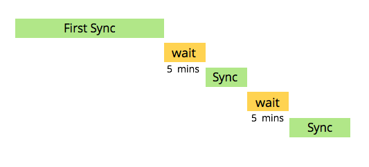

# Veeva CRM Sync 이해 {#understanding-the-veeva-crm-sync}

몇 가지 간단한 단계로 Adobe Marketo Engage과 Veeva CRM 간의 동기화를 쉽게 실행할 수 있습니다.

## 동기화 작동 방식 {#how-the-sync-works}

Marketo Engage은 하루 종일, 매일 Veeva CRM과 동기화됩니다. 각 동기화는 약간의 시간이 소요되고 5분 동안 일시 중지되었다가 다시 시작됩니다.

>[!NOTE]
>
>Marketo Engage이 Veeva에서 전체 데이터베이스를 복사하는 중이므로 첫 번째 동기화는 몇 시간 또는 며칠이 걸릴 수 있습니다. 그 후 각 동기화는 일반적으로 몇 분(경우에 따라 몇 초)이 소요되며, 변경된 데이터만 동기화합니다.

Veeva와 Marketo Engage 간의 동기화는 개인 계정 개체의 연락처 필드에 대해서만 양방향입니다. 이러한 경우 Veeva 또는 Marketo Engage에서 변경할 때마다 업데이트가 두 시스템에 반영됩니다. 다른 모든 동기화는 Veeva에서 Marketo Engage 전용입니다. 각 링크에 대한 자세한 내용을 보려면 아래 링크를 클릭하십시오.

## Marketo Engage과 Veeva 간의 동기화 기능 {#what-is-synced-between-marketo-engage-and-veeva}

* [개인 계정](/help/marketo/product-docs/crm-sync/veeva-crm-sync/sync-details/person-account-sync-faq.md){target="_blank"}
* 사용자
* [호출 및 호출 키 개체](/help/marketo/product-docs/crm-sync/veeva-crm-sync/sync-details/syncing-call-and-call-key-messages.md){target="_blank"}
* [사용자 지정 개체](/help/marketo/product-docs/crm-sync/veeva-crm-sync/sync-details/custom-object-sync.md){target="_blank"}

## 알아야 할 사항 {#things-to-know}

* 다음 [Marketo Engage for Veeva에 입력한 자격 증명](/help/marketo/product-docs/crm-sync/salesforce-sync/setup/enterprise-unlimited-edition/step-2-of-3-create-a-salesforce-user-for-marketo-enterprise-unlimited.md){target="_blank"} 는 데이터를 동기화하는 데 사용됩니다. 해당 자격 증명이 액세스할 수 있는 데이터만 포함됩니다.

* Veeva CRM은 force.com을 기반으로 하며 플랫폼과 관련된 풍부한 경험 Marketo Engage이 이 동기화에 상속됩니다.

* Veeva CRM에는 잠재 고객, 연락처, 계정, 비즈니스 계정, 기회, 캠페인 및 활동이 표시됩니다. 하지만 Marketo Engage과 동기화에서는 지원되지 않습니다.
