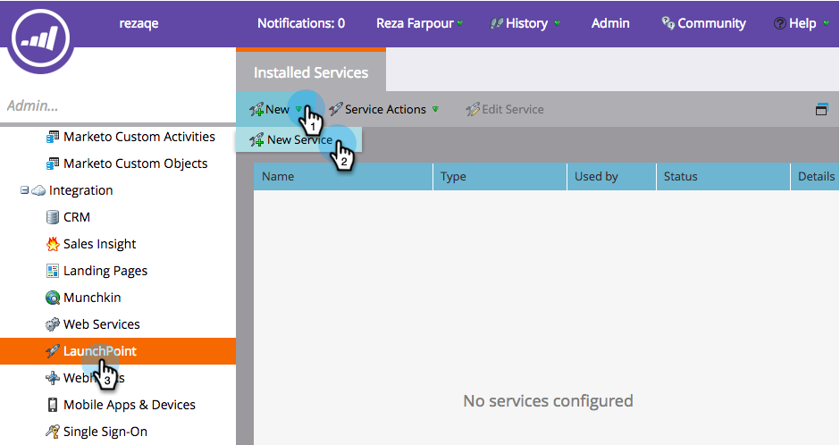
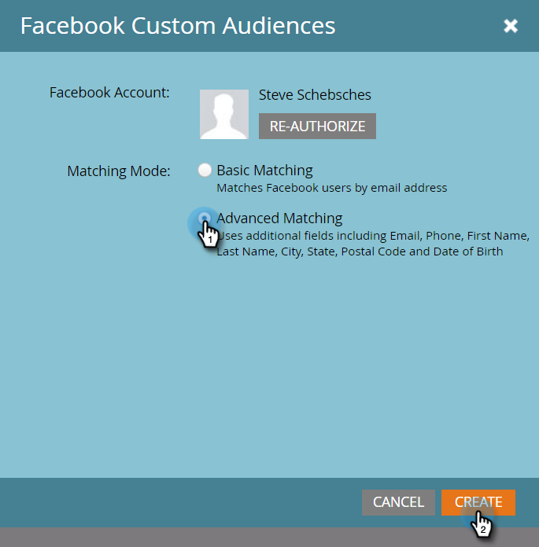

# [!DNL Facebook] 사용자 지정 대상을 [!DNL LaunchPoint] 서비스로 추가 {#add-facebook-custom-audiences-as-a-launchpoint-service}

>[!NOTE]
>
>**관리자 권한 필요**

이 통합을 통해 Marketo 정적 및 스마트 목록의 대상 데이터를 [!DNL Facebook]&#x200B;(으)로 전송하여 [!DNL Facebook] 광고 캠페인에서 사용자 지정 대상으로 사용할 수 있습니다. 설정하려면 다음 단계를 따르십시오.

1. Marketo **[!UICONTROL Admin]**(으)로 이동합니다.

   

1. **[!UICONTROL LaunchPoint]**(으)로 이동하여 **[!UICONTROL New]**&#x200B;을(를) 클릭하고 **[!UICONTROL New Service]**&#x200B;을(를) 선택합니다.

   

1. 서비스에 대한 **[!UICONTROL Display Name]**&#x200B;을(를) 입력하고 **[!UICONTROL Service]** 드롭다운에서 **[!UICONTROL Facebook Custom Audiences]** 서비스를 선택합니다.

   

1. 같은 브라우저에서 새 탭을 열고 [facebook.com](https://www.facebook.com/)&#x200B;(으)로 이동합니다. 통합에 사용할 계정을 사용하여 [!DNL Facebook]에 로그인합니다.

   >[!CAUTION]
   >
   >Marketo에서 여러 Ad Manager 계정에 대상자를 보내려면 다음 단계에서 권한을 부여한 [!DNL Facebook] 사용자가 이러한 계정의 *모두*&#x200B;에 액세스할 수 있어야 합니다.

   

1. [!DNL Facebook]에 로그인한 후 Marketo으로 돌아갑니다. **[!UICONTROL Authorize]**&#x200B;를 클릭합니다.

   

   >[!NOTE]
   >
   >*사용자 지정 대상 통합이 작동하려면 [!DNL Facebook] Business Manager 계정을 사용해야*&#x200B;합니다. Business Manager 계정을 설정하는 방법은 [[!DNL Facebook] 도움말](https://www.facebook.com/business/help/1710077379203657)을 참조하세요.

1. 메시지가 표시되면 **[!UICONTROL OK]**&#x200B;을(를) 클릭하여 [!DNL Facebook]에 Marketo 앱 설치를 수락합니다.

   

1. 이제 권한이 부여되었습니다! 일치하는 모드를 선택하고 **[!UICONTROL Create]**&#x200B;을(를) 클릭합니다.

   >[!NOTE]
   >
   >**[!UICONTROL Basic Matching]**&#x200B;은(는) 전자 메일 주소만 사용합니다. **[!UICONTROL Advanced Matching]**&#x200B;은(는) 7개의 추가 필드를 사용하므로 더 많은 전환을 위해 일치율이 증가합니다. 그러나 회사의 개인정보 처리방침에서 추가 필드 공유를 허용하지 않거나 데이터에 추가 필드가 포함되지 않은 경우 [!UICONTROL Basic Matching]을(를) 선택하세요.

   

   이제 Marketo의 모든 정적 또는 스마트 목록으로 이동하여 대상 데이터를 [!DNL Facebook]에 보낼 수 있습니다.

   >[!CAUTION]
   >
   >통합을 사용하기 전에 [!DNL Facebook] 계정 내에서 [사용자 지정 대상 약관에 동의 [!DNL Facebook]합니다](https://www.facebook.com/ads/manage/customaudiences/tos.php)! 이렇게 하지 않으면 대상자 업데이트가 실패합니다.

>[!MORELIKETHIS]
>
>* [사용자 지정 대상 만들기 [!DNL Facebook]](/help/marketo/product-docs/demand-generation/facebook/create-a-custom-audience-in-facebook.md)
>
>* [리드 광고 설정 [!DNL Facebook] 2}](/help/marketo/product-docs/demand-generation/facebook/set-up-facebook-lead-ads.md)
