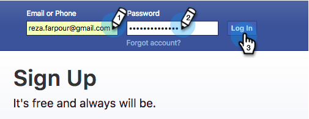

# facebook 사용자 지정 대상을 LaunchPoint Service로 추가 {#add-facebook-custom-audiences-as-a-launchpoint-service}

>[!NOTE]
>
>**관리자 권한 필요**

이 통합을 통해 Marketo Engage 정적 및 스마트 목록의 대상 데이터를 Facebook으로 전송하여 Facebook 광고 캠페인에서 사용자 지정 대상으로 사용할 수 있습니다. 설정 방법은 다음과 같습니다.

1. Marketo으로 이동 **[!UICONTROL 관리자]**.

   

1. 다음으로 이동 **[!UICONTROL 시작 지점]**, 클릭 **[!UICONTROL 신규]** 및 선택 **[!UICONTROL 새 서비스]**.

   

1. 입력 **[!UICONTROL 표시 이름]** 서비스에 대해 다음을 선택합니다. **[!UICONTROL Facebook 사용자 지정 대상]** 다음에서 서비스: **[!UICONTROL 서비스]** 드롭다운.

   

1. 동일한 브라우저에서 새 탭을 열고 로 이동합니다. [facebook.com](https://www.facebook.com/){target="_blank"}. 통합에 사용할 계정을 사용하여 Facebook에 로그인합니다.

   >[!CAUTION]
   >
   >Marketo에서 여러 Ad Manager 계정에 대상자를 보내려면 다음 단계에서 권한을 부여한 Facebook 사용자에게 다음에 대한 액세스 권한이 있어야 합니다 *모두* 이 계정 중.

   

1. facebook에 로그인한 후 Marketo으로 돌아갑니다. 클릭 **[!UICONTROL 승인]**.

   

   >[!NOTE]
   >
   >본인 _필수_ 사용자 지정 대상 통합이 작동하려면 Facebook Business Manager 계정을 사용하십시오. Business Manager 계정을 설정하는 방법은 다음을 참조하십시오. [Facebook 도움말](https://www.facebook.com/business/help/1710077379203657){target="_blank"}.

1. 메시지가 표시되면 **[!UICONTROL 확인]** Marketo 앱을 Facebook에 설치하는 것을 수락합니다.

   

1. 이제 권한이 부여되었습니다! 일치 모드를 선택하고 **[!UICONTROL 만들기]**.

   >[!NOTE]
   >
   >**기본 일치** 은 이메일 주소만 사용합니다. **고급 일치** 에서는 7개의 추가 필드를 사용하며, 더 많은 전환을 위해 일치율을 높입니다. 그러나 회사 개인정보 처리방침에서 추가 필드 공유를 허용하지 않거나 데이터에 포함되지 않은 경우 기본 일치를 선택합니다.

   

   좋습니다! 이제 Marketo의 모든 정적 또는 스마트 목록으로 이동하여 대상 데이터를 Facebook으로 보낼 수 있습니다.

   >[!CAUTION]
   >
   >오, 가기 전에 [facebook의 사용자 지정 대상 약관에 동의](https://www.facebook.com/ads/manage/customaudiences/tos.php){target="_blank"} facebook 계정 내에서! 이렇게 하지 않으면 대상자 업데이트가 실패합니다.

>[!MORELIKETHIS]
>
>* [facebook에서 사용자 지정 대상 만들기](/help/marketo/product-docs/demand-generation/facebook/create-a-custom-audience-in-facebook.md){target="_blank"}
>
>* [facebook 리드 광고 설정](/help/marketo/product-docs/demand-generation/facebook/set-up-facebook-lead-ads.md){target="_blank"}
