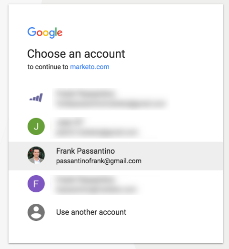
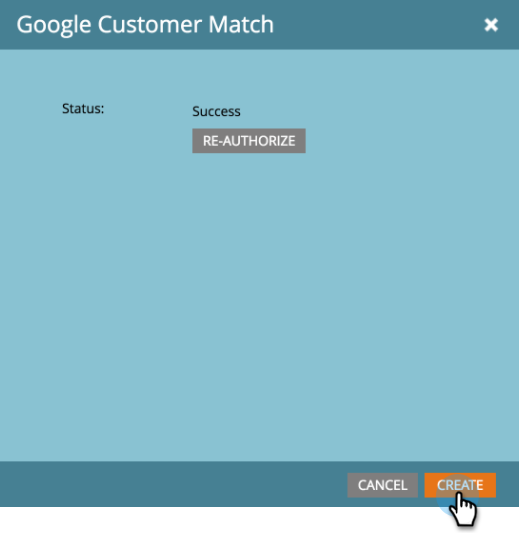

# Google 고객 일치를 LaunchPoint 서비스로 추가 {#add-google-customer-match-as-a-launchpoint-service}

이러한 통합을 통해 Google AdWords를 사용하여 타깃팅할 Marketing To 대상을 Google로 보낼 수 있을 뿐만 아니라 YouTube, Search 및 Gmail에서 대상을 다시 타깃팅할 수 있습니다.

>[!NOTE]
>
>**관리자 권한 필요**

1. **관리**&#x200B;로 이동합니다.

   

1. **LaunchPoint**&#x200B;를 클릭합니다.

   

1. **새로 만들기**&#x200B;새 서비스&#x200B;**를 선택합니다.**

   

1. **표시 이름**&#x200B;을 입력하고 **서비스** 드롭다운에서 **Google 고객 일치**&#x200B;를 선택합니다. **만들기**&#x200B;를 클릭합니다.

   

1. Google AdWords 계정을 연결하려면 **승인**&#x200B;을 클릭합니다.

   

1. Google이 새 탭에서 열립니다. 여기에서 Google AdWords 계정에 로그인합니다.

   >[!CAUTION]
   >
   >Marketing이 여러 AdWords 계정에 대상을 전송하려면 다음 단계에서 승인하는 Google 사용자는 이러한 계정의 _모두_&#x200B;에 액세스할 수 있어야 합니다.

   

1. 요청된 권한을 검토한 다음 **허용**&#x200B;을 클릭합니다.

   

1. 이제 Google AdWords 계정이 Marketing To에 연결되어 있습니다. **만들기**&#x200B;를 클릭합니다.

   

   굉장해! 이제 설치된 서비스 탭에 Google Matched Audiences가 LaunchPoint 서비스로 나열된 것을 볼 수 있습니다.
