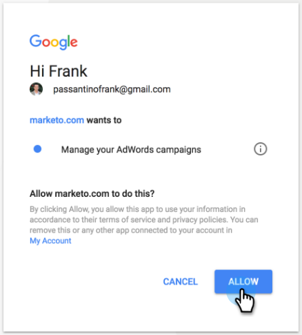

# LaunchPoint Service로 Google 고객 일치 추가 {#add-google-customer-match-as-a-launchpoint-service}

이 통합을 통해 Google AdWords를 사용하여 타깃팅할 Google에 Marketo Engage 대상을 보내고 YouTube, Search 및 Gmail에서 대상을 다시 타깃팅할 수 있습니다.

>[!NOTE]
>
>**관리자 권한 필요**

1. **[!UICONTROL 관리자]**(으)로 이동합니다.

   

1. **[!UICONTROL LaunchPoint]**&#x200B;을 클릭합니다.

   

1. **[!UICONTROL 새로 만들기]**&#x200B;를 선택한 다음 **[!UICONTROL 새 서비스]**&#x200B;를 선택하십시오.

   

1. **[!UICONTROL 표시 이름]**&#x200B;을(를) 입력하고 **[!UICONTROL 서비스]** 드롭다운에서 **[!UICONTROL Google 고객 일치]**&#x200B;을(를) 선택하십시오. **[!UICONTROL 만들기]**&#x200B;를 클릭합니다.

   

1. Google AdWords 계정에 연결하려면 **[!UICONTROL 승인]**&#x200B;을 클릭하십시오.

   

1. Google이 새 탭에서 열립니다. 여기에서 Google AdWords 계정에 로그인합니다.

   >[!CAUTION]
   >
   >Marketo에서 여러 AdWords 계정에 대상자를 보내려면 다음 단계에서 권한을 부여한 Google 사용자가 이러한 계정의 _모두_&#x200B;에 액세스할 수 있어야 합니다.

   

1. 요청된 권한을 검토한 다음 **[!UICONTROL 허용]**&#x200B;을 클릭합니다.

   

1. 이제 Google AdWords 계정이 Marketo에 연결되었습니다. **[!UICONTROL 만들기]**&#x200B;를 클릭합니다.

   

   멋지다! 이제 설치된 서비스 탭에 Google Matched Audiences가 LaunchPoint 서비스로 나열됩니다.

>[!NOTE]
>
>Google Customer Match 통합은 하나의 관리자 계정과 해당 관리자 계정 내의 모든 하위 계정만 수용할 수 있습니다. 여러 관리자 계정이 지원되지 않습니다.
