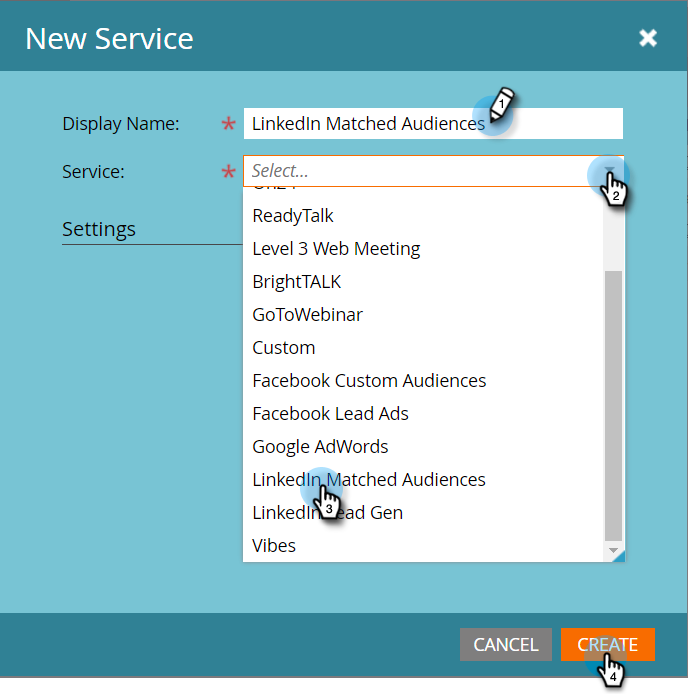
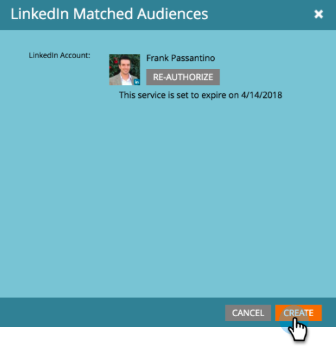

# LaunchPoint 서비스로 LinkedIn 일치 대상 추가 {#add-linkedin-matched-audiences-as-a-launchpoint-service}

>[!NOTE]
>
>**관리자 권한 필요**

Marketing 계정을 LinkedIn 일치된 대상과 연결하여 Marketing의 정적 목록 또는 스마트 목록을 LinkedIn 대상 세그먼트로 사용합니다.

1. 관리 **섹션으로** 이동합니다.

   

1. 론치포인트 **를 선택합니다**.

   

1. [ **신규** 및 **새 서비스]를 선택합니다**.

   

1. 표시 이름 **을**&#x200B;입력하고 LinkedIn과 일치하는 대상&#x200B;**을 선택합니다**. 만들기를 **클릭합니다**.

   

1. LinkedIn 계정을 연결하려면 승인을 **클릭합니다**.

   

   >[!CAUTION]
   >
   >Marketing이 여러 LinkedIn 광고 계정에서 대상을 보내려면, 다음 단계에서 승인한 LinkedIn 사용자가 캠페인 관리자에서 이러한 *모든* 광고 계정에 액세스할 수 있어야 합니다.

1. LinkedIn이 새 탭에서 열립니다. 여기에서 LinkedIn 계정에 로그인합니다.

   

1. 요청된 권한을 검토한 다음 **허용을 클릭합니다**.

   

1. 이제 LinkedIn 계정이 Marketing에 연결되어 있습니다. 만들기를 **클릭합니다**.

   

   대단해! 이제 설치된 서비스 탭에 LinkedIn 일치된 대상이 LaunchPoint 서비스로 나열됩니다.

   

>[!NOTE]
>
>**관련 문서**
>
>* [마케팅 목록 또는 스마트 목록을 LinkedIn 대상 세그먼트로 사용](../../../product-docs/demand-generation/social/social-functions/use-a-marketo-list-or-smart-list-as-a-linkedin-audience-segment.md)

>

