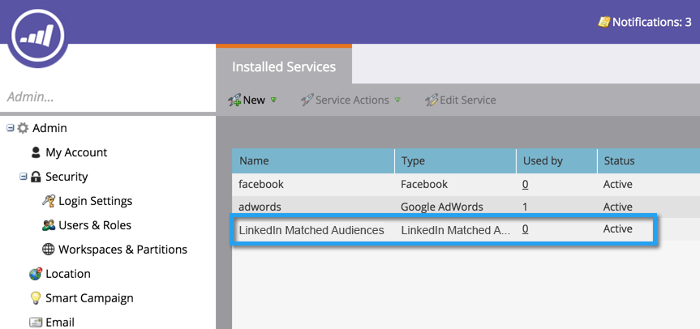

# LinkedIn과 일치하는 대상을 LaunchPoint 서비스 {#add-linkedin-matched-audiences-as-a-launchpoint-service}로 추가

>[!NOTE]
>
>**관리자 권한 필요**

Marketing 계정을 LinkedIn 일치된 대상에 연결하여 Marketing 정적 목록 또는 스마트 목록을 LinkedIn 대상 세그먼트로 사용합니다.

1. **관리** 섹션으로 이동합니다.

   

1. **Launchpoint**&#x200B;를 선택합니다.

   

1. **새로 만들기** 및 **새 서비스**&#x200B;를 선택합니다.

   

1. **표시 이름**&#x200B;을 입력하고 **일치하는 대상 연결**&#x200B;을 선택합니다. **만들기**&#x200B;를 클릭합니다.

   

1. LinkedIn 계정을 연결하려면 **인증**&#x200B;을 클릭합니다.

   

   >[!CAUTION]
   >
   >Marketing이 여러 LinkedIn 광고 계정에서 대상을 보내려면, 다음 단계에서 승인하는 LinkedIn 사용자는 캠페인 관리자에서 이러한 광고 계정의 *모두*&#x200B;에 액세스할 수 있어야 합니다.

1. LinkedIn이 새 탭에서 열립니다. 여기에서 LinkedIn 계정에 로그인합니다.

   

1. 요청된 권한을 검토한 다음 **허용**&#x200B;을 클릭합니다.

   

1. 이제 LinkedIn 계정이 Marketing에 연결됩니다. **만들기**&#x200B;를 클릭합니다.

   

   굉장해! 이제 설치된 서비스 탭에 LaunchPoint 서비스로 나열된 LinkedIn 일치된 대상이 표시됩니다.

   

>[!MORELIKETHIS]
>
>* [LinkedIn 대상 세그먼트로 마케팅 목록 또는 스마트 목록 사용](../../../product-docs/demand-generation/social/social-functions/use-a-marketo-list-or-smart-list-as-a-linkedin-audience-segment.md)

>

