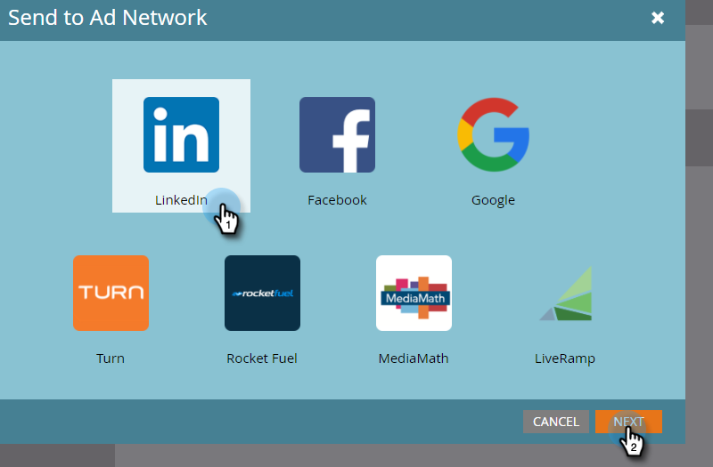

# 광고 네트워크에 목록 보내기 {#send-a-list-to-an-ad-network}

linkedIn, Facebook 또는 Google에 정적 목록을 보내는 방법을 알아봅니다.

## 목록을 보내는 방법 {#how-to-send-a-list}

1. Marketo Engage에서 목록을 선택하고 **[!UICONTROL 작업 나열]** 드롭다운 및 선택 **[!UICONTROL 광고 네트워크로 보내기]**.

   

1. linkedIn, Facebook 또는 Google 중에서 선택합니다(다른 옵션은 현재 사용할 수 없음). 이 예제에서는 **[!UICONTROL LinkedIn]**. 클릭 **[!UICONTROL 다음]**.

   

1. 다음을 클릭합니다. **[!UICONTROL 대상자]** 드롭다운을 클릭하고 원하는 대상을 선택합니다.

   

   >[!TIP]
   >
   >확인해야 하는 경우 상태 탭을 통해 목록이 동기화되는 대상 대상을 확인할 수 있습니다.

1. 원하는 푸시 유형을 선택하고 클릭 **[!UICONTROL 업데이트]**.

   

   >[!NOTE]
   >
   >&quot;지속적인 대상 동기화 활성화&quot;를 선택하면 Marketo은 Marketo 인스턴스에서 목록이 변경될 때 선택한 광고 네트워크에 목록을 최신 상태로 유지합니다. 우리 둘 다 _및_ 정적 목록에 추가되거나 제거된 경우 대상자에서 사람을 제거합니다.

1. 다 됐습니다! 클릭 **[!UICONTROL 확인]** 종료합니다.

   

## FAQ {#faq}

**단일 정적 목록을 여러 광고 대상과 동기화할 수 있습니까?**

아니요. 목록은 단일 대상 대상에만 동기화할 수 있습니다.

**기존 광고 대상자에 대한 연속 동기화를 활성화하면 기존 대상자가 교체됩니까?**

아니요. 기존 대상자는 교체되지 않고 에 추가됩니다.
