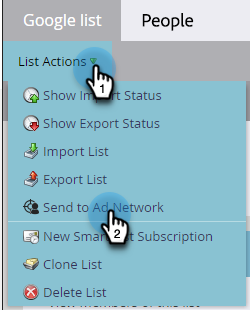

# Google에 목록 보내기 {#send-a-list-to-google}

Google Customer Match를 사용하는 고객의 경우 아래 단계에 따라 Marketo Engage 정적 목록을 Google 계정에 전송하십시오.

1. Marketo Engage에서 원하는 목록을 찾아 선택합니다.

   

1. **작업 나열** 드롭다운을 클릭하고 **광고 네트워크로 보내기**&#x200B;를 선택합니다.

   

1. Google을 선택하고 **다음**&#x200B;을(를) 클릭합니다.

   

1. 원하는 광고 계정을 선택합니다. 기존 대상자를 선택하거나 새 대상자를 만들 수 있습니다. 이 예제에서는 새 파일을 만듭니다. 새 대상자에 이름을 지정합니다.

   

1. 선택 사항을 선택합니다.

   

   >[!NOTE]
   >
   >* **대상자 멤버십 동기화 유지**&#x200B;를 선택하면 인스턴스에서 변경된 목록을 최신 상태로 유지합니다. 정적 목록에 추가되거나 정적 목록에서 제거되면 대상에서 사람을 추가/제거합니다.
   >
   >* 하단의 확인란을 선택하면 광고 및 광고 개인화를 위해 Google 광고에 전송된 사용자 데이터에 대한 동의 상태가 승인됨으로 전송됩니다. 선택하지 않으면 동의 상태가 지정되지 않음으로 전송됩니다. EEA(유럽 경제 지역)의 사용자에 대한 데이터를 업로드하려는 사용자를 위해 Google은 [FAQ](https://support.google.com/google-ads/answer/14310715){target="_blank"} 목록과 [EU 사용자 동의 정책](https://www.google.com/about/company/user-consent-policy/){target="_blank"}을 요약한 추가 세부 정보를 준비했습니다.

1. **업데이트**&#x200B;를 클릭합니다.

   

1. 종료하려면 **확인**&#x200B;을 클릭하세요.

   
