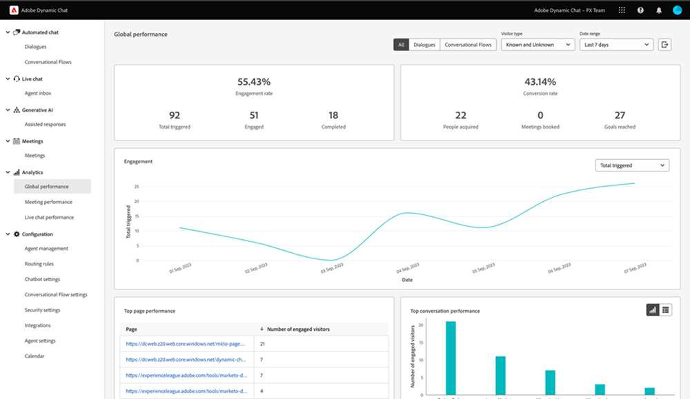

# Analytics {#analytics}

대화 상자 수준에서 보고를 사용할 수 있지만 아래 세 개의 대시보드를 사용하여 전반적인 참여를 확인하십시오.

아래의 각 대시보드에 액세스 **분석** 왼쪽 탐색 메뉴에서

## 전역 성능 대시보드 {#global-performance-dashboard}

참여 및 성과 지표(합계 및 시간 초과), 성과가 가장 높은 페이지 및 성과가 가장 높은 대화 상자를 포함하여 대화 상자의 성과를 확인합니다.

대화 상자, 대화 흐름 또는 모두 보기 알려진 방문자, 알 수 없는 방문자 또는 둘 다 기준으로 정렬합니다. 사전 설정 또는 사용자 지정 날짜 범위를 선택합니다. 버튼을 클릭하여 결과를 내보냅니다.

## 모임 성과 대시보드 {#meeting-performance-dashboard}

얼마나 많은 회의가 예약되고 있는지, 누구와 예약되고 있는지 확인하십시오.

대화 상자, 대화 흐름 또는 모두 보기 사전 설정 또는 사용자 지정 날짜 범위를 선택합니다. 버튼을 클릭하여 결과를 내보냅니다.

## 라이브 채팅 성능 대시보드 {#live-chat-performance-dashboard}

라이브 판매 에이전트가 수행한 대화의 수와 성과가 가장 좋은 팀을 확인합니다.

대화 상자, 대화 흐름 또는 모두 보기 사전 설정 또는 사용자 지정 날짜 범위를 선택합니다. 버튼을 클릭하여 결과를 내보냅니다.

## 정의 {#definitions}

<table>
<thead>
<tbody>
  <tr>
    <td style="width:25%"><b>완료</b></td>
    <td>완료된 이벤트는 방문자가 대화의 마지막 프롬프트에 도달할 때 발생합니다 <i>또는</i> 방문자가 대화의 모든 콘텐츠를 소진하는 경우.
     방문자당, 세션당 하나의 완료된 이벤트.</td>
  </tr>
  <tr>
    <td style="width:25%"><b>획득된 사용자</b></td>
    <td>방문자가 이메일 주소를 제출하면 발생합니다.
     방문자당, 세션당 하나의 획득입니다.</td>
  </tr>
</tbody>
</table>
