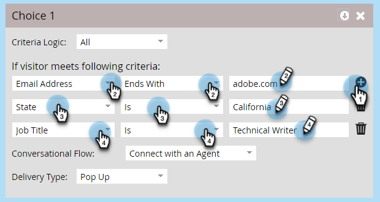

# Forms Marketo Engage에 대한 대화 흐름 설정{#conversational-flow-settings-for-marketo-engage-forms}

Marketo Engage Forms을 Dynamic Chat 대화 흐름과 통합하여 대화형으로 만듭니다. 양식 데이터 또는 스마트 목록 멤버십을 사용하여 모임 예약, 백서 링크 또는 사용자 정의 목표에 대한 잠재 고객의 자격을 즉시 부여합니다.

>[!AVAILABILITY]
>
>스마트 목록 구성원 또는 목록 구성원 기준에는 Dynamic Chat Prime이 필요합니다. 자세한 내용은 Adobe 계정 팀(계정 관리자)에 문의하십시오.

1. 양식을 찾아서 선택합니다(또는 새 양식을 만듭니다).

   

1. 클릭 **[!UICONTROL 초안 편집]**.

   

1. 양식 편집 페이지에서 **[!UICONTROL 양식 설정]**, 그런 다음 **[!UICONTROL 설정]**.

   

1. 다음을 클릭합니다. **[!UICONTROL 대화형 흐름 설정]** 슬라이더를 사용하십시오.

   

1. 기본 선택 모달이 나타납니다. 환경 설정을 선택합니다. 이 예제에서는 다음을 선택합니다 **[!UICONTROL 대화형 흐름 사용]**.

   

1. 원하는 을 선택합니다 **[!UICONTROL 대화 흐름]** 및 **[!UICONTROL 게재 유형]**.

   

   >[!NOTE]
   >
   >[대화 흐름에 대해 자세히 알아보기](/help/marketo/product-docs/demand-generation/dynamic-chat/automated-chat/conversational-flow-overview.md){target="_blank"}

   **선택적 단계**: 다음을 클릭할 수 있습니다. **[!UICONTROL 선택 항목 추가]** 특정 기준을 충족하는 채팅 방문자를 타깃팅하려면 다음을 수행하십시오. 총 10개의 선택 사항에 최대 9개까지 추가할 수 있습니다.

   

   >[!NOTE]
   >
   >방문자의 브라우저는 Static/Smart List의 멤버 자격을 얻으려면 양식 제출 전에 알려진 사람으로서 쿠키여야 합니다.

   **선택적 단계**: 다음을 클릭합니다. **+** 각 단계 내에 서명하여 더 많은 속성을 추가함으로써 타겟팅된 대상자의 범위를 좁힐 수 있습니다(사용 가능한 속성은 양식에 대해 선택한 필드임). 이 예에서는 캘리포니아에 있는 Adobe 기술 문서 작성자를 타겟팅합니다.

   

   >[!NOTE]
   >
   >기준 논리를 &quot;모두&quot;로 설정하면 모든 속성이 충족되어야 자격을 얻을 수 있습니다. 기준 로직이 &quot;any&quot;로 설정된 경우 속성 중 하나이면 충분합니다.

   **선택적 단계**: 두 개 이상의 선택 항목을 추가하는 경우 위쪽/아래쪽 화살표를 클릭하여 선택 항목의 순서를 변경할 수 있습니다.

   

1. 클릭 **[!UICONTROL 완료]** 완료 시.

   
