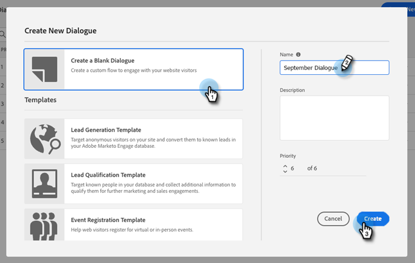

# 대화 상자 만들기 {#create-a-dialogue}

새 대화 상자를 만드는 방법은 다음과 같습니다.

1. 클릭 **대화 상자**.

   

1. 다음을 클릭합니다. **새로 만들기** 단추를 클릭합니다.

   

1. 빈 대화 상자 또는 미리 채워진 템플릿 중 하나를 선택합니다. 이름을 입력하고(설명은 선택 사항) 우선순위 레벨을 변경하고(선택 사항) **만들기**.

   

>[!NOTE]
>
>우선 순위는 방문자가 여러 대화 상자를 동시에 사용할 수 있을 때 표시할 대화 상자를 결정합니다.

다음으로, 방법 알아보기 [스트림 만들기](/help/marketo/product-docs/demand-generation/dynamic-chat/automated-chat/stream-designer.md#create-a-stream){target="_blank"}.

>[!MORELIKETHIS]
>
>* [대상 기준](/help/marketo/product-docs/demand-generation/dynamic-chat/automated-chat/audience-criteria.md){target="_blank"}
>* [스트림 디자이너](/help/marketo/product-docs/demand-generation/dynamic-chat/automated-chat/stream-designer.md){target="_blank"}
