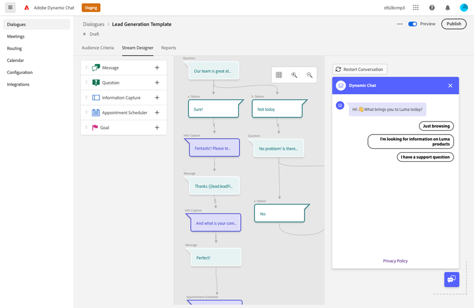

# 대화 상자 개요 {#dialogue-overview}

대화는 개별 채팅 대화입니다. 각 대화 상자에서 특정 채팅 대화가 표시되는 위치와 대상, 대화 내용이 표시될 내용을 결정합니다. 각 대화 상자에는 효과를 모니터링할 수 있는 자체 보고서 페이지도 있습니다.

## 대상 기준 {#audience-criteria}

다음 [대상 기준](/help/marketo/product-docs/demand-generation/dynamic-chat/automated-chat/audience-criteria.md){target="_blank"} 대화 상자의 섹션은 채팅 대화가 표시될 위치와 대상을 정의하는 위치입니다

## 스트림 디자이너 {#stream-designer}

다음 [스트림 디자이너](/help/marketo/product-docs/demand-generation/dynamic-chat/automated-chat/stream-designer.md){target="_blank"} 대화 상자의 섹션에서 웹 사이트 방문자와 나눌 대화를 디자인할 수 있습니다.

## 보고서 {#reports}

보고서 탭에서는 대화 상자의 성능 수준에 대한 지표를 볼 수 있습니다.

<table>
 <tr>
  <td><strong>트리거된 총 수</strong></td>
  <td>방문자가 대화 상자 자격을 갖출 때마다 증가합니다.
</td>
 </tr>
 <tr>
  <td><strong>참여</strong></td>
  <td>방문자가 대화 상자에서 하나 이상의 카드와 상호 작용할 때 증가합니다(예: 질문, 정보 캡처 등).</td>
 </tr>
 <tr>
  <td><strong>완료</strong></td>
  <td>방문자가 대화 상자의 분기 끝에 도달할 때마다 증가합니다.</td>
 </tr>
 <tr>
  <td><strong>획득된 사용자</strong></td>
  <td>방문자가 대화 상자 흐름에서 유효한 이메일 주소를 제공할 때마다 증가합니다.</td>
 </tr>
 <tr>
  <td><strong>예약된 회의</strong></td>
  <td>방문자가 챗봇을 통해 약속을 성공적으로 예약할 때마다 증가합니다.</td>
 </tr>
 <tr>
  <td><strong>목표 도달</strong></td>
  <td>대화 상자 흐름에서 방문자가 목표에 도달할 때마다 증가합니다.</td>
 </tr>
</table>

## 모든 대화 상자 비활성화/활성화 {#disable-enable-all-dialogues}

게시된 모든 대화 상자를 동시에 비활성화(및 다시 활성화)할 수 있습니다.

1. Dynamic Chat에서 **구성** 탭.

   

1. 전환 **채팅 활성화됨** 모든 대화 상자를 비활성화하려면 끄고 다시 활성화하려면 켜십시오.

   
