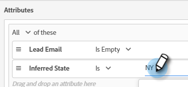

# 대화 상자 {#dialogues}

대화 상자는 개별 채팅 대화입니다. 시각적으로 사용자 지정하고, 페이지가 표시되는 페이지를 결정하며, 표시되는 페이지와 이를 보는 사용자를 결정하는 방법을 알아봅니다.

## 새 대화 상자 만들기 {#create-a-new-dialogue}

1. **대화 상자**&#x200B;를 클릭합니다.

   

1. **새로 만들기** 단추를 클릭합니다.

   

1. 이름을 입력하고(설명은 선택 사항) 우선 순위 수준을 설정한 다음 **저장**&#x200B;을 클릭합니다.

   

>[!NOTE]
>
>우선 순위는 방문자가 여러 대화 상자에 동시에 적합한 경우 방문자에게 표시할 대화 상자를 결정합니다.

## 대상 기준 {#audience-criteria}

Marketo 스마트 목록과 유사한 대상 기준 속성을 사용하여 타겟 대상을 정의할 수 있습니다. 추론된, 개인 또는 회사 속성(또는 이들의 조합)을 사용하여 알려진 사람 또는 알 수 없는 사람을 타깃팅할 수 있습니다.

**알려진 사람**

선택할 _많은_ 속성 조합이 있습니다. 이 예에서는 50명 이상의 직원이 있는 회사에서 일하는 모든 **알려진 사람**&#x200B;을 타겟팅합니다.

1. **개인 상태** 속성을 선택하고 오른쪽으로 드래그합니다.

   

1. __ Isis는 기본적으로 설정됩니다. 값 선택 필드에 CA를 입력합니다. 드롭다운을 클릭하고 목록에서 선택할 수도 있습니다.

   

1. **회사 크기** 속성을 선택하고 _특성을 여기에 끌어다 놓습니다_.

   

   >[!NOTE]
   >
   >**+** 아이콘을 클릭하여 속성을 선택할 수도 있습니다.

1. 연산자 드롭다운을 클릭하고 **보다 큼**&#x200B;을 선택합니다.

   

1. 50을 입력하고 화면의 아무 곳이나 클릭하여 저장합니다.

   

**익명 사용자**

아직 데이터베이스에 없는 사용자를 대상으로 하는 쉬운 방법이 있습니다. 이 예에서는 New York 영역에 있는 모든 **익명 사용자**&#x200B;를 타겟팅합니다.

1. **개인 전자 메일** 속성을 선택하고 오른쪽으로 드래그합니다.

   

1. 연산자 드롭다운을 클릭하고 **비어 있음**&#x200B;을 선택합니다.

   

1. **유추 상태** 속성을 선택하고 _특성을 여기에 끌어다 놓습니다_.

   

   >[!NOTE]
   >
   >누군가 웹 사이트를 방문하면 [Munchkin](/help/marketo/product-docs/administration/additional-integrations/add-munchkin-tracking-code-to-your-website.md)이 쿠키를 쿠키로 사용하여 시스템에 넣습니다. 특수 데이터베이스에서 IP를 조회하고 모든 종류의 좋은 정보를 추론합니다.

1. __ Isis는 기본적으로 설정됩니다. 값 선택 필드에 NY를 입력합니다(드롭다운을 클릭하고 목록에서 선택할 수도 있음).

   

## 그룹 추가 {#add-groups}

다른 속성의 &quot;모두&quot; 또는 &quot;모두&quot;와 함께 모든 특정 속성을 포함하려는 경우 속성을 그룹화하는 옵션이 있습니다. 여러 그룹을 추가할 수 있습니다.

## Target {#target}

여기에서 특정 대화 상자를 표시할 URL을 입력합니다.

허용 가능한 형식:

* `http://website.com`
* `https://*.website.com`
* `http://website.com/folder/*`
* `https://*.website.com/folder/*`

>[!NOTE]
>
>별표를 사용하는 것은 다목적 엽서 역할을 합니다. 따라서 `https://*.website.com` 은 하위 도메인을 포함하여 사이트의 모든 페이지에 대화 상자를 둡니다(예: `support.website.com`) 그리고 `https://website.com/folder/*` 은 후속 폴더의 모든 HTML 페이지에 대화 상자를 둡니다(예: 이 경우 폴더가 &quot;sports&quot;라고 가정해 보겠습니다. website.com/sports/baseball.html, website.com/sports/football.html 등)

## 스트림 디자이너 {#stream-designer}

스트림 디자이너에는 채팅 대화 모양을 만들기 위해 추가할 수 있는 다른 카드가 포함되어 있습니다.

<table>
 <tr>
  <td><strong>본문</strong></td>
  <td>응답 없이 구문을 만들려면(예: "안녕! SAVE25" 코드를 사용하면 모든 항목이 오늘 25% 할인됩니다.
</td>
 </tr>
 <tr>
  <td><strong>질문</strong></td>
  <td>사용 가능한 응답을 제공하는 다중 선택 질문을 하려면 를 사용합니다(예: 어떤 차종에 관심이 있으십니까? 응답 = SUV, 컴팩트, 트럭 등).</td>
 </tr>
 <tr>
  <td><strong>정보 캡처</strong></td>
  <td>정보를 수집하려면 를 사용하십시오. 선택할 수 있는 세 개의 필드는 이메일 주소, 전화 번호 및 텍스트(방문자가 고유한 메시지를 작성할 수 있음)입니다.</td>
 </tr>
 <tr>
  <td><strong>약속 스케줄러</strong></td>
  <td>방문자에게 후속 작업을 예약하기 위해 사용 가능한 날짜 달력을 제공합니다. 일정 가용성은 <a href="/help/marketo/product-docs/demand-generation/dynamic-chat/dynamic-chat-overview.md#routing">다음 에이전트를 줄</a>에 반영합니다.</td>
 </tr>
 <tr>
  <td><strong>목표</strong></td>
  <td>방문자가 볼 수 없는 유일한 카드입니다. 특정 채팅(예: 방문자의 이메일을 수집하는 것이 목표인 경우 스트림에서 정보 캡처 바로 뒤에 목표 카드를 배치합니다.</td>
 </tr>
</table>

**스트림 만들기**

가능한 스트림 조합이 _많습니다._ 이 문서](/help/marketo/product-docs/demand-generation/dynamic-chat/create-a-stream.md)에서 [의 예를 살펴보겠습니다.

## 보고서 {#reports}

보고서 탭에서 지난 90일의 데이터를 봅니다. 각 카테고리는 아래에 정의되어 있습니다.

<table>
 <tr>
  <td><strong>총 트리거됨</strong></td>
  <td>방문자가 자격을 얻거나 대화 상자를 표시할 때마다 증가합니다.
</td>
 </tr>
 <tr>
  <td><strong>참여</strong></td>
  <td>방문자가 chatbot 앵커를 클릭하여 대화 상자를 열 때마다 증가합니다.</td>
 </tr>
 <tr>
  <td><strong>완료됨</strong></td>
  <td>방문자가 대화 상자의 모든 분기 끝에 도달할 때마다 증가합니다.</td>
 </tr>
 <tr>
  <td><strong>잡힌 사람</strong></td>
  <td>방문자가 대화 상자 흐름에서 유효한 이메일 주소를 제공할 때마다 증가합니다.</td>
 </tr>
 <tr>
  <td><strong>예약된 모임</strong></td>
  <td>방문자가 chatbot을 통해 약속을 성공적으로 예약할 때마다 증가합니다.</td>
 </tr>
 <tr>
  <td><strong>목표 달성</strong></td>
  <td>방문자가 모든 대화 상자 흐름에서 목표에 도달할 때마다 증가합니다.</td>
 </tr>
</table>

>[!MORELIKETHIS]
>
>[스트림 만들기](/help/marketo/product-docs/demand-generation/dynamic-chat/create-a-stream.md)
