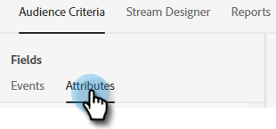

# 대상 기준 {#audience-criteria}

Marketo 스마트 목록과 유사한 대상 기준 속성을 사용하여 타겟 대상을 정의할 수 있습니다. 추론된, 개인 또는 회사 속성(또는 이들의 조합)을 사용하여 알려진 사람 또는 알 수 없는 사람을 타깃팅할 수 있습니다.

## 이벤트 {#events}

이벤트를 사용하면 스크롤하는 정도나 페이지/사이트에 있는 시간을 기반으로 방문자를 타깃팅할 수 있습니다. 아래 예에서는 20초 이상 특정 페이지에 있었던 방문자를 타깃팅합니다.

1. 을 선택합니다. **페이지 시간** 이벤트를 끌어서 오른쪽으로 드래그합니다.

   

1. &quot;보다 큼&quot; 시간을 20초로 설정합니다.

   

1. 원하는 페이지의 URL을 [Target](#target) 섹션을 참조하십시오.

   

## 속성 {#attributes}

**알려진 사람**

있습니다 _많은_ 선택할 속성 조합입니다. 아래 예에서는 모두 타겟팅합니다 **알려진 사람** 50명 이상의 직원을 가진 회사에서 일하는 캘리포니아에서.

1. 을 선택합니다. **개인 주** 속성을 지정하고 오른쪽으로 드래그합니다.

   

1. _다음_ 은 기본적으로 설정되어 있습니다. 값 선택 필드에 CA를 입력합니다. 드롭다운을 클릭하고 목록에서 선택할 수도 있습니다.

   

1. 을 선택합니다. **회사 크기** 속성을 지정한 위치로 드래그합니다. _특성을 여기에 끌어다 놓습니다._.

   

   >[!NOTE]
   >
   >속성을 클릭하여 선택할 수도 있습니다 **+** 아이콘.

1. 연산자 드롭다운을 클릭하고 을(를) 선택합니다 **보다 큼**.

   

1. 50을 입력하고 화면의 아무 곳이나 클릭하여 저장합니다.

   

그게 다야!

**익명 사용자**

아직 데이터베이스에 없는 사용자를 대상으로 하는 쉬운 방법이 있습니다. 이 예에서는 모두 타겟팅합니다 **익명의 사람들** 뉴욕 지역에 위치하고 있습니다.

1. 을 선택합니다. **개인 이메일** 속성을 지정하고 오른쪽으로 드래그합니다.

   

1. 연산자 드롭다운을 클릭하고 을(를) 선택합니다 **비어 있음**.

   

1. 을 선택합니다. **유추 상태** 속성을 지정한 위치로 드래그합니다. _특성을 여기에 끌어다 놓습니다._.

   

   >[!NOTE]
   >
   >누군가 여러분의 웹 사이트를 방문하면, [Munchkin](/help/marketo/product-docs/administration/additional-integrations/add-munchkin-tracking-code-to-your-website.md) 쿠키로 구워서 시스템에 넣습니다. 특수 데이터베이스에서 IP를 조회하고 모든 종류의 좋은 정보를 추론합니다.

1. _다음_ 은 기본적으로 설정되어 있습니다. 값 선택 필드에 NY를 입력합니다(드롭다운을 클릭하고 목록에서 선택할 수도 있음).

   

## 그룹 추가 {#add-groups}

다른 속성의 &quot;모두&quot; 또는 &quot;모두&quot;와 함께 모든 특정 속성을 포함하려는 경우 속성을 그룹화하는 옵션이 있습니다. 여러 그룹을 추가할 수 있습니다.

## 대상 {#target}

여기에서 특정 대화 상자를 표시할 URL을 입력합니다. 제외 추가 선택 사항도 있습니다.

허용 가능한 형식:

* `http://website.com`
* `https://*.website.com`
* `http://website.com/folder/*`
* `https://*.website.com/folder/*`

>[!NOTE]
>
>별표를 사용하는 것은 다목적 엽서 역할을 합니다. 그래서 `https://*.website.com` 은 하위 도메인을 포함하여 사이트의 모든 페이지에 대화 상자를 둡니다(예: `support.website.com`). 및 `https://website.com/folder/*` 대화 상자가 후속 폴더의 모든 HTML 페이지에 표시됩니다(예: 이 경우 폴더가 &quot;sports&quot;라고 가정해 보겠습니다. website.com/sports/baseball.html, website.com/sports/football.html 등)

**제외**

제외 를 사용하여 대화 상자가 수행하는지 확인 **not** 사이트의 특정 페이지/영역에 표시됩니다. 제외는 포함과 동일한 형식을 따릅니다.

>[!MORELIKETHIS]
>
>* [대화 상자 만들기](/help/marketo/product-docs/demand-generation/dynamic-chat/dialogues/create-a-dialogue.md){target=&quot;_blank&quot;}
>* [스트림 디자이너](/help/marketo/product-docs/demand-generation/dynamic-chat/dialogues/stream-designer.md){target=&quot;_blank&quot;}
>* [보고서](/help/marketo/product-docs/demand-generation/dynamic-chat/dialogues/reports.md){target=&quot;_blank&quot;}

