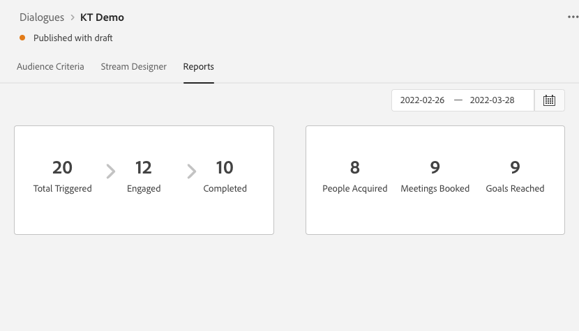

# 대화 상자 개요 {#dialogue-overview}

대화 상자는 개별 채팅 대화입니다. 각 대화 상자에서는 특정 채팅 대화가 표시되는 위치와 대화 내용 및 내용을 결정합니다. 또한 각 대화 상자에는 효과를 모니터링할 수 있는 자체 보고서 페이지가 있습니다.

## 대상 기준 {#audience-criteria}

다음 [대상 기준](/help/marketo/product-docs/demand-generation/dynamic-chat/dialogues/audience-criteria.md)대화 상자의 {target=&quot;_blank&quot;} 섹션은 채팅 대화가 표시되는 위치와 대상을 정의합니다

## 스트림 디자이너 {#stream-designer}

다음 [스트림 디자이너](/help/marketo/product-docs/demand-generation/dynamic-chat/dialogues/stream-designer.md)대화 상자의 {target=&quot;_blank&quot;} 섹션은 웹 사이트 방문자와 함께 할 대화를 디자인할 곳입니다.

## 보고서 {#reports}

다음 [보고서](/help/marketo/product-docs/demand-generation/dynamic-chat/dialogues/reports.md)대화 상자의 {target=&quot;_blank&quot;} 섹션에서 대화 상자가 얼마나 잘 수행되는지에 대한 지표를 볼 수 있습니다.

## 모든 대화 상자 비활성화/활성화 {#disable-enable-all-dialogues}

게시된 모든 대화 상자를 동시에 비활성화(및 재활성화)할 수 있습니다.

1. Dynamic Chat에서 **구성** 탭.

   

1. 전환 **채팅 사용** 모든 대화 상자를 비활성화(다시 활성화)하려면 로 전환합니다.

   
