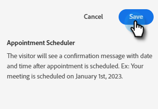
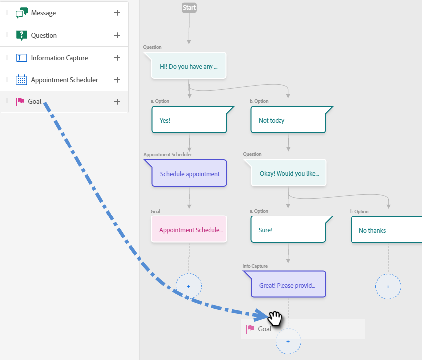

# 스트림 디자이너 {#stream-designer}

다음 항목이 있습니다. _많음_ 스트림 조합이 가능합니다. 이 문서에는 마케터가 사이트 방문자에게 제품 관련 질문이 있는지 묻는 예제가 포함되어 있습니다. 그렇다면 방문자는 약속을 예약할 수 있습니다. 없는 경우, 방문자에게 향후 서신을 보낼 메일링 목록에 가입할 수 있는 옵션이 제공됩니다. 무료 PDF도 제공됩니다. 최종 목표는 약속을 예약하거나 방문자의 이메일을 수집하는 것입니다.

>[!PREREQUISITES]
>
>문서 카드를 사용하려면 먼저 다음을 수행해야 합니다 [설정](/help/marketo/product-docs/demand-generation/dynamic-chat/integrations/using-the-document-card.md){target="_blank"} Adobe 계정에서.

## 스트림 디자이너 카드 {#stream-designer-cards}

스트림 디자이너에는 채팅 대화를 형성하는 데 추가할 수 있는 여러 카드가 포함되어 있습니다.

<table>
 <tr>
  <td><strong>메시지</strong></td>
  <td>응답이 필요하지 않은 명령문을 만들고자 할 때 사용합니다(예: "안녕하세요! 모든 품목은 오늘 25% 할인 코드 SAVE25").
</td>
 </tr>
 <tr>
  <td><strong>질문</strong></td>
  <td>사용 가능한 응답(예: 어떤 유형의 차량에 관심이 있습니까?)을 제공하는 객관식 질문을 하려는 경우 사용합니다. 응답 = SUV, 소형, 트럭 등).</td>
 </tr>
 <tr>
  <td><strong>문서</strong></td>
  <td>대화 상자에 PDF 문서를 포함하고 방문자의 문서 참여 활동(문서를 다운로드한 경우 본 페이지 수 및/또는 사용된 검색어)을 추적할 수 있습니다.</td>
 </tr>
 <tr>
  <td><strong>정보 캡처</strong></td>
  <td>정보를 수집하려는 경우 를 사용합니다. 선택할 3개의 필드는 이메일 주소, 전화 번호 및 텍스트(방문자가 자신의 메시지를 작성할 수 있음)입니다.</td>
 </tr>
 <tr>
  <td><strong>약속 스케줄러</strong></td>
  <td>방문자에게 후속 작업을 예약할 수 있는 사용 가능한 날짜 일정을 제공합니다. 일정 가용성은 다음을 반영합니다. <a href="/help/marketo/product-docs/demand-generation/dynamic-chat/dynamic-chat-overview.md#routing">줄 서 있는 다음 에이전트</a>.</td>
 </tr>
 <tr>
  <td><strong>목표</strong></td>
  <td>방문자가 볼 수 없는 유일한 카드입니다. 특정 채팅 내에서 어느 시점에 목표가 달성되었는지 확인하는 것입니다(예: 방문자의 이메일을 수집하는 것이 본인의 목표인 경우 스트림에서 정보 캡처 바로 뒤에 목표 카드를 놓으십시오).</td>
 </tr>
</table>

## 스트림 디자이너 아이콘 {#stream-designer-icons}

스트림 디자이너의 오른쪽 상단에는 몇 가지 아이콘이 표시됩니다. 그들이 하는 일은 다음과 같습니다.

<table>
 <tr>
  <td></td>
  <td>해당 보기를 선호하는 사용자의 배경에 표를 추가합니다.</td>
 </tr>
 <tr>
  <td></td>
  <td>확대하기, 더 큰 카드 만들기</td>
 </tr>
 <tr>
  <td></td>
  <td>축소하여 더 작은 카드 만들기</td>
 </tr>
 <tr>
  <td></td>
  <td>채팅을 테스트할 수 있는 창을 엽니다(닫으려면 동일한 버튼 누름).</td>
 </tr>
 <tr>
  <td></td>
  <td>스트림에 있는 모든 카드 정렬</td>
 </tr>
</table>

## 스트림 만들기 {#create-a-stream}

1. 다음 작업을 수행한 후 [이(가) 내 대화 상자를 만들었습니다.](/help/marketo/product-docs/demand-generation/dynamic-chat/dialogues/create-a-dialogue.md){target="_blank"}를 클릭하고 **스트림 디자이너** 탭.

   

1. 질문 카드를 끌어서 놓습니다.

   

1. 챗봇 응답 아래에서 원하는 방식에 대해 질문을 합니다.

   

   >[!TIP]
   >
   >토큰을 사용하여 알려진 채팅 방문자에 대한 경험을 개인화할 수 있습니다(예: Hello `{{lead.leadFirstName:""}}`). 오른쪽에 있는 중괄호 아이콘을 클릭하고 원하는 항목을 선택하십시오. 익명 방문자에게 일반적인 것을 표시하려면 따옴표 사이에 기본값을 추가합니다(예: Hello `{{lead.leadFirstName:"there"}}`).

   >[!NOTE]
   >
   >Poke는 기본적으로 on으로 설정되어 있으며, 방문자가 채팅 아이콘을 클릭하여 보지 않아도 채팅 아이콘 옆에 열린 질문을 표시합니다. Poke는 대화의 첫 번째 카드에서만 사용할 수 있습니다.

1. 사용자 응답을 입력하고 **저장**.

   

   >[!NOTE]
   >
   >**저장된 값 편집** 는 질문 카드에서 매핑된 속성을 위해 챗봇의 방문자에게 표시되는 것과 다른 값을 데이터베이스에 저장하려는 사용자를 위한 선택적 단계입니다(예: 방문자에게 &quot;검색 엔진 최적화&quot;가 표시되면 해당 값을 &quot;SEO&quot;로 저장).

1. &quot;예&quot;의 경우 약속을 예약하려고 하므로 해당 옵션 아래에 약속 스케줄러 카드로 끌어서 놓습니다.

   

1. 오른쪽 열에서 **저장**.

   

1. 목표이므로 약속 스케줄러 아래에 목표 카드를 드래그합니다.

   

1. 목표에 이름을 지정하고(또는 기존 목표를 선택) **저장**.

   

1. &quot;아니요&quot;의 경우 메일링 목록에 참여할지 여부를 확인하고 싶으므로 해당 옵션 아래에 다른 질문 카드를 드래그하십시오.

   

1. 응답을 입력하고 방문자에 대한 응답 선택 사항을 추가합니다. 클릭 **저장** 완료 시.

   

   >[!NOTE]
   >
   >다음을 클릭하여 응답을 추가할 수 있습니다. **응답 추가**.

1. &quot;예&quot; 응답 아래에서 방문자의 이메일을 수집할 수 있도록 정보 캡처 카드 위로 드래그합니다.

   

1. 다음을 클릭합니다. **유형** 드롭다운 및 선택 **이메일**.

   

1. 챗봇 메시지 및 자리 표시자를 입력합니다. 속성이 Marketo의 적절한 필드에 매핑되어 있는지 확인하고 **저장**.

   

   <table>
    <tr>
     <td><strong>유형</strong></td>
     <td>캡처할 정보 유형(전화, 텍스트, 이메일)입니다.</td>
    </tr>
    <tr>
     <td><strong>챗봇 메시지</strong></td>
     <td>방문자에게 정보를 입력하라는 메시지가 표시됩니다.</td>
    </tr>
    <tr>
     <td><strong>플레이스홀더</strong></td>
     <td>방문자가 입력할 내용을 확인하는 데 도움이 되는 샘플 텍스트입니다.</td>
    </tr>
    <tr>
     <td><strong>속성에 대한 응답 매핑</strong></td>
     <td>Marketo 구독에서 방문자의 응답을 개인 레코드의 해당 필드에 동기화할 수 있습니다.</td>
    </tr>
   </table>

1. 이메일 수집이 목표이므로 정보 캡처 아래의 목표 카드를 드래그합니다.

   

1. 목표에 이름을 지정하고(또는 기존 목표를 선택) **저장**.

   

1. &quot;아니요&quot;라고 말하면 응답을 추가하는 것을 잊지 마십시오. 한 가지 옵션은 아래에 메시지 카드를 드래그하여 &quot;어쨌든 감사합니다.&quot;라고 말하는 것입니다. 그러나 이 예제에서는 무료 PDF 문서를 대신 제공합니다.

   

1. 이 예제에서는 새 문서를 만듭니다. 이름을 지정하고 이미 호스팅된 PDF의 URL을 입력한 다음 을 클릭합니다. **저장**.

   

1. 다음 항목 선택 **미리 보기** 대화 상자를 미리 보려면 전환합니다.

   

1. 대화 상자를 활성화할 준비가 되면 다음을 클릭하십시오. **게시**.

   

>[!NOTE]
>
>게시를 클릭하기 전에 다음을 확인하십시오. [대상 URL을 입력했습니다.](/help/marketo/product-docs/demand-generation/dynamic-chat/dialogues/audience-criteria.md#target){target="_blank"}.

>[!MORELIKETHIS]
>
>* [대화 상자 만들기](/help/marketo/product-docs/demand-generation/dynamic-chat/dialogues/create-a-dialogue.md){target="_blank"}
>* [대상 기준](/help/marketo/product-docs/demand-generation/dynamic-chat/dialogues/audience-criteria.md){target="_blank"}
>* [보고서](/help/marketo/product-docs/demand-generation/dynamic-chat/dialogues/reports.md){target="_blank"}
>* [문서 카드 사용](/help/marketo/product-docs/demand-generation/dynamic-chat/integrations/using-the-document-card.md){target="_blank"}
