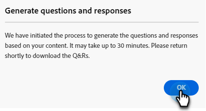

# 질문 생성 {#question-generation}

모든 작업과 관련 세부 정보(예: 생성 시기, 총 질문 수, 승인 상태 등)를 확인합니다.

## 질문 생성 {#generate-questions}

1. 생성 AI에서 **[!UICONTROL 지원 응답]**&#x200B;을 클릭합니다.

   

1. **[!UICONTROL 질문 생성]**&#x200B;을 클릭합니다.

   

1. 작업에 이름을 지정하고 모든 콘텐츠를 추출할 소스 URL(최대 10개)을 입력합니다. 원하는 주제/키워드를 입력하고 키보드에서 Enter 키를 누릅니다. 완료되면 **[!UICONTROL 생성]**&#x200B;을 클릭하세요.

   

   >[!IMPORTANT]
   >
   >Marketo Engage허용 목록에 추가하다 가 제공된 URL에서 컨텐츠를 스크랩할 수 있도록 하려면 먼저 몇 개의 IP 주소를 스크랩해야 합니다. [자세한 내용은 아래를 참조하십시오](#ip-addresses-to-allowlist).

   >[!NOTE]
   >
   >사이트/페이지는 정보를 스크랩하려면 공개(즉, 로그인 뒤에 숨기지 않음)여야 합니다.

1. 콘텐츠에 따라 질문 및 응답 생성에는 최대 30분이 소요될 수 있습니다. **[!UICONTROL 확인]**&#x200B;을 클릭합니다.

   

   >[!TIP]
   >
   >질문 생성의 최신 상태를 보려면 새로 고침을 누르십시오.

   

## 질문 및 응답 다운로드 {#download-questions-and-responses}

>[!NOTE]
>
>생성된 질문과 응답은 [응답 라이브러리](/help/marketo/product-docs/demand-generation/dynamic-chat/generative-ai/response-library.md)에서도 볼 수 있습니다.

1. 원하는 작업을 찾아 이름 옆에 있는 다운로드 아이콘을 클릭합니다.

   

1. 브라우저에서 다운로드 폴더를 찾아 파일을 선택합니다. 사용하는 브라우저에 따라 다르게 보일 수 있습니다.

   

1. **[!DNL Task details]**&#x200B;은(는) Excel 파일에 질문 및/또는 응답을 추가/편집하는 방법에 대한 지침을 포함하여 작업에 대한 다양한 세부 정보를 표시합니다.

   

   >[!NOTE]
   >
   >질문 및/또는 응답을 일괄 추가/편집하기로 결정한 경우 [여기에서 다시 업로드하는 방법을 알아보세요](/help/marketo/product-docs/demand-generation/dynamic-chat/generative-ai/response-library.md).

1. **[!DNL Q&Rs]** 탭에는 생성된 질문 및 응답을 포함한 추가 세부 정보가 있습니다.

   

## IP 주소 허용 목록 {#ip-addresses-to-allowlist}

질문 및 응답이 생성되는 동안 웹 URL에서 컨텐츠를 추출하려면 아래에서 해당 지역을 찾아 해당 지역과 연결된 IP 주소가 웹 팀에서 허용 목록에추가된으로 제공되는지 확인하십시오.

<table width="450">
<thead>
  <tr>
    <th>북아메리카</th>
    <th>유럽</th>
    <th>APAC</th>
  </tr>
</thead>
<tbody>
  <tr>
    <td>13.68.17.252</td>
    <td>20.105.150.224</td>
    <td>20.213.91.77</td>
  </tr>
</tbody>
</table>
