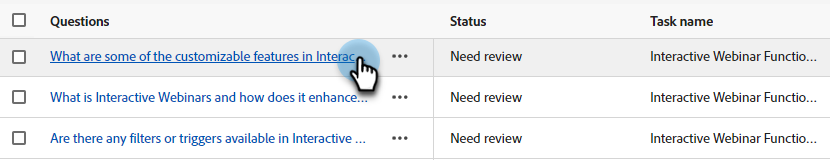

# 응답 라이브러리 {#response-library}

한 곳에서 모든 질문, 승인 상태 및 할당된 작업 이름/주제를 봅니다.

## 수동으로 질문 추가 {#manually-add-a-question}

1. 생성 AI에서 **[!UICONTROL Assisted responses]**&#x200B;을(를) 클릭합니다.

   

1. **[!UICONTROL Response library]** 탭을 클릭합니다.

   

1. **[!UICONTROL Add question]**&#x200B;을(를) 클릭합니다.

   

1. 질문 및 응답을 입력합니다. 주제를 할당하고 사용자가 방문자와 공유할 수 있는 선택적 URL을 추가합니다. 완료되면 **[!UICONTROL Save]**&#x200B;을(를) 클릭합니다.

   

1. 새로 고침을 클릭하면 새 질문이 맨 위에 &quot;[!UICONTROL Processing]&quot; 상태로 나타납니다.

   

1. 몇 분 후에 다시 새로 고침하면 상태가 &quot;승인됨&quot;으로 변경됩니다.

   

## 개별 질문/응답 편집 {#generate-a-new-question}

>[!NOTE]
>
>생성된 모든 질문 및 응답에는 기본적으로 &quot;[!UICONTROL need review]&quot; 상태가 할당됩니다. 채팅 방문자는 &quot;[!UICONTROL approved]&quot;개의 질문과 응답만 사용할 수 있습니다.

1. **[!UICONTROL Response library]**&#x200B;에서 원하는 질문을 클릭합니다.

   

1. 편집하고 **[!UICONTROL Save]**&#x200B;을(를) 클릭합니다.

   

## 질문/응답 일괄 편집 및 업로드 {#bulk-edit-and-upload-questions-responses}

[다운로드한 Excel 파일](/help/marketo/product-docs/demand-generation/dynamic-chat/generative-ai/question-generation.md#download-questions-and-responses){target="_blank"}에서 일괄 편집하는 방법에 대한 지침은 다음과 같습니다. 파일의 작업 세부 사항 탭에서도 볼 수 있습니다.

<table>
<thead>
  <tr>
    <th>액션</th>
    <th>지침</th>
  </tr>
</thead>
<tbody>
  <tr>
    <td>질문 편집</td>
    <td>"editedQuestion" 열(H열)에 새 질문을 입력합니다.</td>
  </tr>
  <tr>
    <td>응답 편집</td>
    <td>"editedResponse" 열(I열)에 새 응답 입력</td>
  </tr>
  <tr>
    <td>새 질문 추가</td>
    <td>"editedQuestion" 열(H 열)에 새 질문을 입력하고 questionResponseld를 비워 둡니다. 또한 "topics" 열(C 열)에는 적절한 항목을 입력하고 "sourceUr!" 열에는 소스 URL을 입력해야 합니다.</td>
  </tr>
  <tr>
    <td>질문 및 답변 추가</td>
    <td>"editedQuestion" 열(H열)에 새 질문을 입력하고 "editedResponse" 열(I열)에 새 응답을 입력한 다음 questionResponseld를 비워 둡니다. 또한 "주제" 열(C열)에 적절한 주제를 입력해야 합니다.</td>
  </tr>
</tbody>
</table>

1. 파일에서 편집을 마친 후 **[!UICONTROL Response library]** 탭으로 돌아가 **[!UICONTROL Upload responses]**&#x200B;을(를) 클릭합니다.

   

1. 해당 작업 이름을 입력합니다. 파일을 드래그 앤 드롭하거나 장치에서 찾아 선택합니다. 완료되면 **[!UICONTROL Save]**&#x200B;을(를) 클릭합니다.

   

1. 확인이 나타나고 설정이 모두 완료되었습니다.

   

## 질문 필터링 {#filter-your-questions}

기본적으로 질문은 생성 시간/날짜별로 순서대로 나열되며, 최신 질문이 먼저 표시됩니다. 특정 질문을 찾고 있는 경우 필터를 적용하여 검색 범위를 좁힙니다. 항목, 작업 이름 및/또는 승인 상태별로 필터링합니다.

