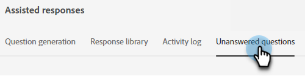

# 답변되지 않은 질문 {#unanswered-questions}

챗봇이 대답할 수 없는 모든 질문 및/또는 방문자가 &quot;도움이 되지 않음&quot;으로 표시한 질문을 확인하고 이 중요한 정보를 사용하여 사전 승인된 추가 응답을 만듭니다.

>[!NOTE]
>
>답변되지 않은 질문 목록은 24시간마다 자정(PST)에 자동으로 새로 고쳐집니다.

1. 생성 AI에서 **[!UICONTROL Assisted responses]**&#x200B;을(를) 클릭합니다.

   

1. **[!UICONTROL Unanswered questions]** 탭을 클릭합니다.

   

1. 응답을 만들 답변이 없는 질문을 선택합니다.

   

1. 응답을 입력합니다. 주제를 할당하고 사용자가 방문자와 공유할 수 있는 선택적 URL을 추가합니다. 완료되면 **[!UICONTROL Save]**&#x200B;를 클릭합니다.

   

1. 이제 답변되지 않은 질문에 답변이 제공되며 응답 라이브러리에 자동으로 추가됩니다.

   
