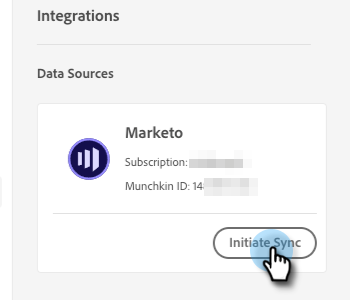

# Adobe Marketo Engage {#adobe-marketo-engage}

## 연결 Dynamic Chat {#connecting-dynamic-chat}

[초기 설정](/help/marketo/product-docs/demand-generation/dynamic-chat/setup-and-configuration/initial-setup.md){target="_blank"}을 완료한 후 Adobe Marketo Engage 구독과 Dynamic Chat 연결 1회 동기화를 수행할 차례입니다.

>[!NOTE]
>
>Dynamic Chat은 [Marketo 기본](https://experienceleague.adobe.com/ko/docs/marketo-developer/marketo/rest/lead-database/field-types){target="_blank"}과(와) 사용자 정의 개인 필드 및 회사 필드 동기화를 지원합니다.

1. 내 Marketo에서 **[!UICONTROL Dynamic Chat]** 타일을 클릭합니다.

   

   >[!NOTE]
   >
   >타일이 표시되지 않으면 Marketo 관리자에게 문의하십시오.

1. 이전에 Adobe ID으로 애플리케이션에 액세스한 적이 있다면 바로 Dynamic Chat 상태가 됩니다. 그렇지 않으면 [Adobe ID을 설정](https://helpx.adobe.com/kr/manage-account/using/create-update-adobe-id.html){target="_blank"}합니다.

1. Marketo 인스턴스를 연결하려면 **[!UICONTROL 통합]**&#x200B;을 선택하세요.

   

1. Marketo 카드에서 **[!UICONTROL 동기화 시작]**&#x200B;을 클릭합니다.

   

1. 대상 타기팅, 데이터 매핑 및 개인화에 사용할 Dynamic Chat과 동기화하려면 Marketo 인스턴스에서 최대 50개의 속성(표준 또는 사용자 지정 필드)을 선택합니다. 완료되면 **[!UICONTROL 다음]**&#x200B;을 클릭하세요.

   

1. 선택 항목을 검토합니다. 동기화를 시작하려면 **[!UICONTROL 확인]**&#x200B;을 클릭하세요.

   

>[!NOTE]
>
>데이터베이스 크기에 따라 동기화가 완료되기까지 2~24시간 정도 소요될 수 있습니다.

## 속성 추가 {#add-an-attribute}

초기 동기화 후 속성을 추가하는 방법은 다음과 같습니다.

1. **[!UICONTROL 통합]**&#x200B;에서 **[!UICONTROL Adobe Marketo Engage]** 탭을 선택하고 **[!UICONTROL 특성 추가]**&#x200B;를 클릭합니다.

   

1. 추가할 특성을 선택하고 **[!UICONTROL 다음]**&#x200B;을(를) 클릭합니다.

   

1. 선택 내용을 검토하고 **[!UICONTROL 확인]**&#x200B;을 클릭합니다.

   

## 속성 제거 {#remove-an-attribute}

초기 동기화 후 특성을 제거하는 방법은 다음과 같습니다.

>[!NOTE]
>
>현재 대화 상자에서 사용하고 있지 않은 속성만 제거하는 옵션이 표시됩니다.

1. **[!UICONTROL 통합]**&#x200B;에서 **[!UICONTROL Adobe Marketo Engage]** 탭을 선택하고 제거할 특성을 클릭합니다.

   

1. **[!UICONTROL 특성 제거]**&#x200B;를 클릭합니다.

   

>[!MORELIKETHIS]
>
>[초기 설정](/help/marketo/product-docs/demand-generation/dynamic-chat/setup-and-configuration/initial-setup.md){target="_blank"}
