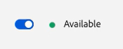

# 에이전트 받은 편지함 {#agent-inbox}

에이전트는 에이전트 받은 편지함 내에 라이브 채팅을 표시합니다. 활성 대화 외에도 과거 대화, 방문자 정보 등을 볼 수 있습니다.

## 가용성 전환 {#availability-toggle}

에이전트 받은 편지함 화면의 오른쪽 상단에는 상태를 사용 가능 또는 사용 불가로 설정할 수 있는 옵션이 있습니다.

>[!IMPORTANT]
>
>**에이전트 설정에서 설정한 [실시간 채팅 가용성](/help/marketo/product-docs/demand-generation/dynamic-chat/setup-and-configuration/agent-settings.md#live-chat-availability){target="_blank"}을 재정의합니다**. 상태를 다시 전환하거나 사용 가능한 다음 시간 블록으로 전환할 때까지 유지됩니다.

>[!NOTE]
>
>상태를 사용할 수 없음으로 설정하면 활성 채팅에 영향을 주지 않습니다.

## 라이브 채팅 알림 {#live-chat-notifications}

[실시간 채팅 개요](/help/marketo/product-docs/demand-generation/dynamic-chat/live-chat/live-chat-overview.md#live-chat-notifications){target="_blank"}에서 알림에 대해 자세히 알아보세요.

## 대화 {#conversations}

[에이전트 받은 편지함] 화면의 왼쪽에서는 활성 대화만 표시하거나 모든 대화를 표시하도록 선택할 수 있습니다.

>[!NOTE]
>
>자신과 다른 에이전트로부터 과거(비활성) 대화를 볼 수 있지만 자신의 활성 대화만 볼 수 있습니다.

## 방문자 정보 {#visitor-information}

[에이전트 받은 편지함] 화면의 오른쪽에서 이름, 직함, 전자 메일 주소, 전화 번호 및 CRM 상태 등의 해당 사용자를 위에서 아래로 볼 수 있습니다. 전달되지 않은 모든 정보는 대시(-)로 표시됩니다.

## 세션 종료 {#end-a-session}

에이전트는 방문자 정보 옆에 있는 **세션 종료** 단추를 클릭하여 세션을 수동으로 종료할 수 있습니다.

## 활동 내역 {#activity-history}

방문자 정보 아래는 활동 기록입니다. 활동 유형 및 날짜를 보고 채팅 기록을 봅니다.

>[!NOTE]
>
>지난 90일 동안만 정보가 표시됩니다.

## 캘린더 공유 {#calendar-sharing}

라이브 채팅 창 하단에 있는 아이콘을 통해 다른 에이전트의 캘린더를 채팅 방문자와 공유할 수 있습니다.

1. 달력 아이콘을 클릭합니다.

   

1. 원하는 에이전트 일정을 선택하고 **보내기**&#x200B;를 클릭합니다.

   

1. 채팅 방문자는 모임을 예약할 수 있습니다.

   

