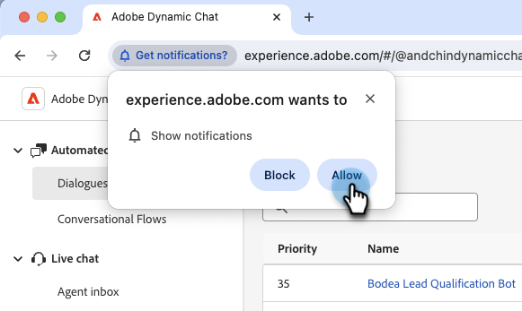

# 알림 {#notifications}

라이브 채팅에 대한 브라우저 알림을 받으려면 모든 라이브 채팅 에이전트가 메시지가 표시되면 Dynamic Chat에 대한 브라우저 알림을 활성화해야 합니다.

라이브 채팅 에이전트가 로그인하면 화면 상단에 &quot;라이브 채팅 알림을 받으려면 브라우저 알림을 활성화하십시오.&quot;라는 배너가 표시됩니다. **사용**&#x200B;을 클릭합니다.

그러면 실시간 채팅 에이전트가 알림을 표시하도록 브라우저에서 메시지를 표시합니다. **허용**&#x200B;을 클릭합니다.

## Chrome에서 알림 활성화{#enable-notifications-in-chrome}

### Windows용 Chrome

Google에서 [이 문서](https://support.mozilla.org/en-US/kb/push-notifications-firefox){target="_blank"}에서 Windows용 브라우저 알림을 사용하도록 설정하는 단계를 간략하게 설명합니다.

### Mac OS용 Chrome

(여기에 John의 단계 삽입)

## Firefox에서 알림 활성화{#enable-notifications-in-firefox}

Firefox에서는 [이 문서](https://support.mozilla.org/en-US/kb/push-notifications-firefox){target="_blank"}에서 다양한 브라우저 버전 및 운영 체제에 대한 단계를 간략하게 설명합니다.

## OS 알림 {#os-notifications}

에이전트가 브라우저에서 알림을 허용한 후에도 여전히 알림을 받지 않는 경우 OS 알림 설정에서 브라우저에 대한 알림을 활성화해야 할 수 있습니다.

[알림: Mac](https://support.apple.com/guide/mac-help/change-notifications-settings-mh40583/mac){target="_blank"}

[알림: Windows](https://support.microsoft.com/en-us/windows/change-notification-settings-in-windows-8942c744-6198-fe56-4639-34320cf9444e){target="_blank"}

MSI 작업 알림이 발생했습니까???
