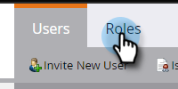

# 채팅 사용자 추가 또는 제거 {#add-or-remove-chat-users}

채팅 사용자를 추가하거나 제거하려면 아래 단계를 따르십시오.

>[!NOTE]
>
>기본적으로 모든 Marketo Engage 관리자에게는 Dynamic Chat의 관리자 권한이 부여됩니다.

## 채팅 사용자 추가 {#add-a-chat-user}

1. [Adobe Admin Console](https://adminconsole.adobe.com/){target="_blank"}에 로그인합니다.

   

1. **[!UICONTROL Dynamic Chat]**&#x200B;을 클릭합니다.

   

   >[!NOTE]
   >
   >Marketo 구독이 두 개 이상인 경우 다음 단계 전에 원하는 구독을 선택하십시오.

1. **[!UICONTROL 사용자]** 탭을 클릭합니다.

   

1. **[!UICONTROL 사용자 추가]** 단추를 클릭합니다.

   

1. 추가하려는 사용자의 이름, 사용자 그룹 또는 이메일 주소를 입력합니다. 이름과 성은 선택 사항입니다.

   

1. **+** 아이콘을 클릭하고 원하는 제품 프로필을 선택합니다.

   

1. **[!UICONTROL 저장]**&#x200B;을 클릭합니다.

   

   >[!NOTE]
   >
   >Adobe 관리 콘솔에서 사용자를 추가한 후 Dynamic Chat 에이전트 관리 페이지에 표시하는 데 최대 2시간이 걸릴 수 있습니다.

## Marketo 역할에 Dynamic Chat 액세스 추가 {#add-dynamic-chat-access-to-marketo-role}

새로 추가된 채팅 사용자의 Marketo 역할에 아직 Dynamic Chat 권한이 없는 경우 추가하는 방법은 다음과 같습니다.

1. Marketo에서 **[!UICONTROL 관리자]**&#x200B;를 클릭하고 **[!UICONTROL 사용자 및 역할]**&#x200B;을 선택합니다.

   

1. **[!UICONTROL 역할]** 탭을 클릭합니다.

   

1. 목록에서 수정할 역할을 선택하고 **[!UICONTROL 역할 편집]**&#x200B;을 클릭합니다.

   

1. **[!UICONTROL Dynamic Chat 액세스]**&#x200B;를 선택하고 **[!UICONTROL 저장]**&#x200B;을 클릭합니다.

   

## 채팅 사용자 제거 {#remove-a-chat-user}

1. [Adobe Admin Console](https://adminconsole.adobe.com/){target="_blank"}에 로그인합니다.

   

1. **[!UICONTROL Dynamic Chat]**&#x200B;을 클릭합니다.

   

   >[!NOTE]
   >
   >Marketo 구독이 두 개 이상인 경우 다음 단계 전에 원하는 구독을 선택하십시오.

1. **[!UICONTROL 사용자]** 탭을 클릭합니다.

   

1. 제거할 사용자를 선택합니다.

   

1. **[!UICONTROL 사용자 제거]** 단추를 클릭합니다.

   

1. 확인하려면 **[!UICONTROL 사용자 제거]**&#x200B;를 클릭하세요.

   

>[!MORELIKETHIS]
>
>* [Adobe Admin Console 사용자](https://helpx.adobe.com/kr/enterprise/using/users.html){target="_blank"}
>* [개별적으로 사용자 관리](https://helpx.adobe.com/enterprise/using/manage-users-individually.html){target="_blank"}
