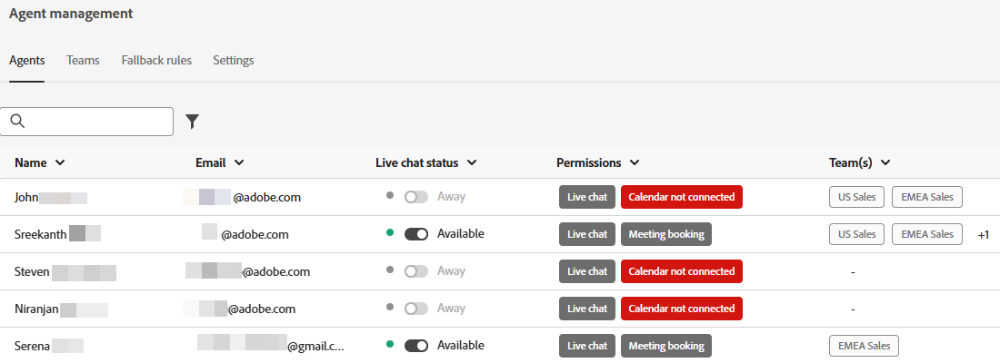

# 에이전트 관리 {#agent-management}

에이전트 관리에서 Dynamic Chat 인스턴스의 에이전트 목록을 보고, 팀을 관리하고, 대체 규칙을 설정합니다.

## 상담원 {#agents}

이 탭에는 Dynamic Chat 인스턴스의 모든 에이전트가 나열되며 여기에는 이름, 이메일 주소, 라이브 채팅 상태 등의 정보가 포함됩니다.

## 팀 {#teams}

관리자는 에이전트 팀을 만들어 특정 영업 에이전트 그룹으로 쉽게 라우팅할 수 있습니다.

### 팀 만들기 {#create-a-team}

1. 클릭 **+ 팀 만들기**.

   

1. 팀에 이름을 지정하십시오.

   

1. 다음을 클릭합니다. **에이전트 추가** 드롭다운을 클릭하고 원하는 에이전트를 선택합니다.

   

1. Click **Create**.

   

## 대체 규칙 {#fallback-rules}

### 모임 대체 항목 {#meeting-fallback}

회의 예약을 사용할 수 없을 때 방문자가 볼 수 있도록 표준(시스템) 메시지를 선택하거나 사용자 지정 메시지를 작성하십시오.

### 라이브 채팅 대체 {#live-chat-fallback}

표준(시스템) 메시지를 선택하거나 방문자가 Live Chat을 사용할 수 없을 때 볼 수 있도록 사용자 지정 메시지를 작성하십시오.

>[!NOTE]
>
>선택 **모임 예약 옵션 포함** 확인란을 선택하면 라이브 채팅에 액세스할 수 있는 에이전트가 없을 때 채팅 방문자가 모임을 예약할 수 있는 옵션이 제공됩니다.

>[!TIP]
>
>사용자 지정 메시지를 만들 때 글꼴 스타일을 지정하고 링크를 사용하거나 이모지를 삽입할 수 있습니다. `:)`
