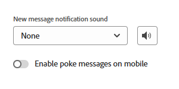

# 구성 {#configuration}

챗봇 대화 상자 창의 모양과 느낌을 맞춤화하는 방법에 대해 알아봅니다.

시작하려면 다음을 클릭하십시오. **챗봇 설정** 아래에 **구성**.

몇 가지 다양한 사용자 지정 옵션이 있습니다.

## 스타일 탭 {#style-tab}

### 스타일 {#style}

여기에서 색상, 글꼴, 보트 위젯의 배치, 챗봇의 이름/아바타 등 대화 상자가 표시되는 챗봇의 모양과 느낌을 정의할 수 있습니다.

각 카테고리의 색상은 다음에 의해 결정됩니다. [16진수 색상 값](https://color.adobe.com/create/color-wheel){target="_blank"} (예: 흰색 = #ffffff, 빨간색 = #bf1932 등).

앵커(Anchor)를 사용하면 사이트 방문자가 챗박스를 열거나 닫을 수 있습니다. 해당 아이콘을 오른쪽 하단에 표시할지 왼쪽 하단에 표시할지 선택할 수 있습니다. 패딩(아이콘과 웹 페이지의 하단 사이의 공간)을 늘리거나 줄일 수도 있습니다.

### 보트 설정 {#agent-settings}

봇 설정에서 맨 위에 표시되는 챗박스(예: &quot;Adobe 도우미&quot;)에 레이블을 추가할 수 있습니다. 응답 지연(초)을 확인하고 채팅 아바타를 변경할 수도 있습니다. 자신의 아바타 이미지를 업로드하려면 **+** 단추를 클릭합니다.

>[!NOTE]
>
>사용자 지정 아바타는 256kb보다 작고 200x200px보다 작은 정사각형 이미지여야 합니다. 지원되는 파일 유형은 .jpg, .png, .gif, .webp, .svg입니다.

변경을 마치면 다음을 클릭합니다. **저장**.

## 개인 정보 탭 {#privacy-tab}

다음을 클릭합니다. **개인 정보 보호** 사이트 개인정보 처리방침의 URL을 추가/편집하는 탭입니다(선택 사항).

## 설치 탭 {#installation-tab}

웹 사이트에 챗봇이 표시되려면 먼저 Dynamic Chat JavaScript 코드 조각을 설치해야 합니다. 이 탭을 클릭하여 필요한 코드를 찾아 복사합니다. 이 작업에 익숙하지 않은 경우 웹 팀이나 IT 부서에 지원을 요청하십시오.

>[!TIP]
>
>사이트에서 CSP(콘텐츠 보안 정책)를 사용하는 경우 추가할 내용은 코드 아래를 참조하십시오.

>[!NOTE]
>
>Marketo 지원 은 HTML 문제 해결을 지원하기 위해 설정되어 있지 않습니다. HTML 지원이 필요한 경우 웹 개발자에게 문의하십시오.
