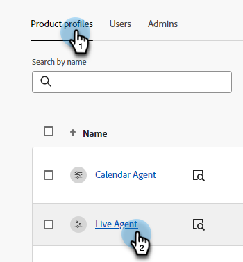
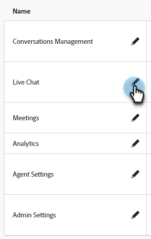

# 권한 {#permissions}

Dynamic Chat의 다양한 영역에 대한 사용자 액세스를 관리합니다.

1. 다음에서 [Adobe Admin Console](https://adminconsole.adobe.com/){target="_blank"}, 클릭 **Dynamic Chat**.

   

1. 다음에서 **제품 프로필** 탭에서 편집할 프로필을 선택합니다. 이 예제에서는 **라이브 에이전트**.

   

1. 다음을 클릭합니다. **권한** 탭.

   

1. 편집할 Dynamic Chat 영역을 선택합니다. Live Agent 프로필을 선택했으므로 Live Chat 을 선택합니다. 연필 아이콘을 클릭합니다.

   

1. 사용 가능한 모든 권한 항목은 왼쪽에 있습니다. 권한을 하나씩 또는 모두 한 번에 추가하도록 선택할 수 있습니다. 이 예제에서는 모두를 선택합니다. 다음을 클릭합니다. **+ 모두 추가** 단추를 클릭합니다.

   

   >[!NOTE]
   >
   >자동 포함을 활성화하면 모든 권한 항목이 포함 목록에 추가됩니다. 새 권한 항목을 사용할 수 있게 되면 해당 제품 프로필에 자동으로 포함됩니다.

1. **저장**&#x200B;을 클릭합니다.

   

이제 다른 모든 Dynamic Chat 영역에 대해 이 프로세스를 반복할 수 있습니다.

## 권한 목록 {#list-of-permissions}

아래에는 사용 가능한 모든 권한 목록이 영역별로 정렬되어 있습니다.

<table>
<thead>
  <tr>
    <th>Dynamic Chat 영역</th>
    <th>권한</th>
  </tr>
</thead>
<tbody>
  <tr>
    <td>대화 관리</td>
    <td><li>대화 상자 보기</li>
    <li>대화 상자 관리(만들기, 삭제)</li>
    <li>게시 대화 상자</li>
    <li>대화 흐름 보기</li>
    <li>대화 흐름 관리(만들기, 삭제)</li>
    <li>대화 흐름 게시</li></td>
  </tr>
  <tr>
    <td>라이브 채팅</td>
    <td><li>에이전트 받은 편지함</li>
    <li>내 대화 보기</li>
    <li>모든 대화 보기</li>
    <li>대화 요약 보기<b>*</b></li>
    <li>지원 응답 보기<b>*</b></li></td>
  </tr>
  <tr>
    <td>회의</td>
    <td><li>모든 모임 관리</li>
    <li>내 모임 관리</li></td>
  </tr>
  <tr>
    <td>Analytics</td>
    <td><li>글로벌 성과 보고서 보기</li>
    <li>라이브 채팅 보고서 보기</li>
    <li>모임 보고서 보기</li>
    <li>보고서 내보내기</li></td>
  </tr>
  <tr>
    <td>에이전트 설정</td>
    <td><li>라이브 채팅 가용성 관리</li>
    <li>캘린더 연결</li>
    <li>일정 가용성 관리</li></td>
  </tr>
  <tr>
    <td>관리자 설정</td>
    <td><li>작업 영역 보기<b>*</b></li>
    <li>작업 공간 관리(만들기, 편집, 삭제)<b>*</b></li>
    <li>라운드 로빈 보기</li>
    <li>사용자 정의 규칙 보기</li>
    <li>사용자 정의 규칙 관리(추가, 편집, 삭제)</li>
    <li>계정 목록 보기<b>*</b></li>
    <li>계정 관리(추가, 편집, 삭제)<b>*</b></li>
    <li>챗봇 설정 관리</li>
    <li>대화 흐름 설정 관리</li>
    <li>개인 정보 및 보안 관리</li>
    <li>통합 관리</li>
    <li>언어 관리<b>*</b></li>
    <li>에이전트 관리</li>
    <li>에이전트 팀 보기<b>*</b></li>
    <li>에이전트 팀 관리(추가, 편집, 삭제)<b>*</b></li>
    <li>사용 제한 보기</li></td>
  </tr>
</tbody>
</table>

**&#42;** 현재 Dynamic Prime 사용자만 사용할 수 있습니다.
