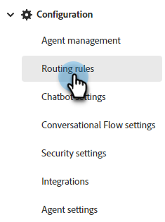

# 라우팅 {#routing}

Dynamic Chat에서 예약된 회의는 두 가지 방법으로 라우팅될 수 있습니다. 라운드 로빈 또는 사용자 지정 규칙 사용.

라운드 로빈: 모임이 에이전트에 순차적으로 할당됩니다. 그래서 당신이 5명의 요원들과 3번 요원이 마지막 회의를 가졌다면, 4번 요원이 다음 회의를 가질 것이고, 5번 요원이 그 후에 1번 요원으로 돌아갈 것입니다.

사용자 지정 규칙: 선택한 속성에 따라 회의를 수신할 특정 에이전트를 선택할 수 있습니다.

>[!NOTE]
>
>계정 라우팅에 가장 높은 우선 순위가 지정됩니다. 방문자가 회의를 예약하거나 실시간 채팅을 시작하는 대화 지점에 도달하면 다른 라우팅 옵션을 고려하기 전에 먼저 [계정 라우팅](#account-routing)을(를) 확인합니다.

## 사용자 지정 규칙 만들기 {#create-a-custom-rule}

이 예에서는 유추한 CA, OR 및 WA 상태의 모든 회의를 John 에이전트에게 보냅니다.

1. 구성에서 **라우팅 규칙**&#x200B;을 클릭합니다.

   

1. **사용자 지정 규칙** 탭을 클릭합니다.

   

1. **규칙 만들기**&#x200B;를 클릭합니다.

   

1. 규칙 이름을 지정합니다. 원할 경우 설명을 추가하고 우선 순위 수준을 설정할 수 있습니다. **다음**&#x200B;을 클릭합니다.

   

1. 원하는 에이전트를 선택합니다.

   

1. 원하는 속성 위로 드래그합니다.

   

1. 원하는 값을 찾아 선택합니다.

   

1. 원하는 값을 모두 선택한 경우 **저장**&#x200B;을 클릭합니다.

   

## 계정 라우팅 {#account-routing}

대상 계정 및 해당 영업 소유자를 식별하고 해당 계정에서 오는 방문자 경로를 해당 계정 소유자에게 직접 업로드합니다.

### 계정 추가 {#add-an-account}

이 예에서는 모든 직원을 레고에서 스티븐 요원으로 직접 안내합니다.

1. 계정 라우팅 탭에서 **+ 계정 추가**&#x200B;를 클릭합니다.

   

   >[!TIP]
   >
   >**계정 목록 업로드**&#x200B;를 클릭하고 CSV를 업로드하여 한 번에 여러 계정을 만들 수 있습니다.

1. 회사 이름, 도메인을 입력하고 원하는 에이전트를 선택합니다.

   
