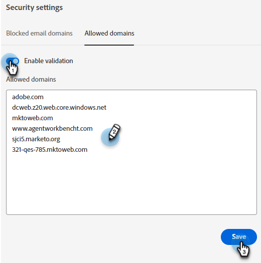

# 보안 설정 {#security-settings}

보안 설정에서 차단 또는 허용 목록에 도메인을 추가할 수 있습니다.

## 차단된 이메일 도메인 {#blocked-email-domains}

에이전트와 상호 작용하지 않으려는 이메일 도메인을 사용하는 방문자(예: 경쟁업체)가 있는 경우 해당 이메일 도메인을 차단 목록에 추가하다에 추가합니다.

1. 다음 항목 선택 **유효성 검사 활성화** 차단 목록에 추가하다 슬라이더를 활성화하십시오. 최대 50개의 도메인을 입력하고 **저장**.

   

## 허용된 도메인 {#allowed-domains}

허용된 도메인을 추가하면 타사에서 사이트에서 Javascript를 스크랩하여 자신의 사이트에 추가할 수 없습니다.

1. 다음 항목 선택 **유효성 검사 활성화** 허용 목록에 추가하다 슬라이더를 활성화하십시오. 허용된 도메인을 입력하고 을(를) 클릭합니다 **저장**.

   
