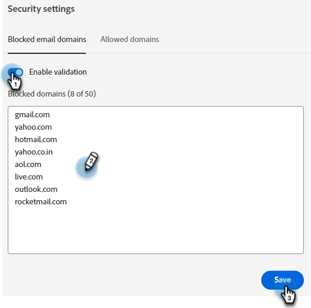
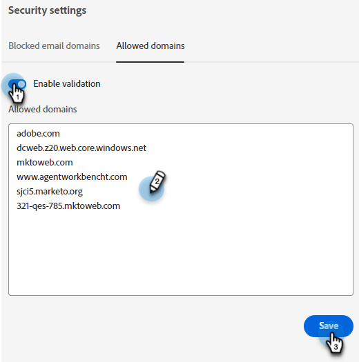

# 보안 설정 {#security-settings}

보안 설정에서 차단 또는 허용 목록에 도메인을 추가할 수 있습니다.

>[!IMPORTANT]
>
>차단 및 이메일 도메인 허용 필터링은 방문자가 챗봇 또는 대화 흐름에서 Dynamic Chat 내에 직접 이메일 주소를 입력하는 경우에만 적용됩니다. Dynamic Chat이 Marketo Engage과 같은 통합 제품에서 수신하는 이메일 주소에는 적용되지 않습니다. 자세한 내용은 아래 표를 참조하십시오.

| 시나리오 | 필터링이 적용됩니까? |
|---|---|
| 방문자가 Dynamic Chat 챗봇에 직접 이메일을 입력합니다 | 예 |
| 방문자가 자신의 이메일을 Dynamic Chat 대화 흐름에 직접 입력 | 예 |
| 이메일은 Marketo 양식 제출로 미리 채워집니다(대화형 흐름은 양식 채우기 후 표시됨) | 아니요 |
| 이메일이 다른 통합 시스템에서 Dynamic Chat으로 전달됩니다. | 아니요 |

## 차단된 이메일 도메인 {#blocked-email-domains}

에이전트와 상호 작용하지 않으려는 이메일 도메인을 사용하는 방문자(예: 경쟁업체)가 있는 경우 해당 이메일 도메인을 차단 목록에 추가하다에 추가합니다.

1. **유효성 검사 활성화** 슬라이더를 선택하여 차단 목록을 활성화합니다. 최대 50개의 도메인을 입력하고 **저장**&#x200B;을 클릭합니다.

   

## 허용된 도메인 {#allowed-domains}

허용된 도메인을 추가하면 타사에서 사이트에서 Javascript를 스크랩하여 자신의 사이트에 추가할 수 없습니다.

1. **유효성 검사 활성화** 슬라이더를 선택하여 허용 목록을 활성화합니다. 허용된 도메인을 입력하고 **저장**&#x200B;을 클릭합니다.

   
