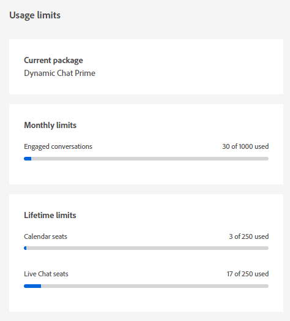

# 사용 제한 {#usage-limits}

패키지 정보 및 사용 제한 상태와 같은 중요한 정보를 보려면 사용 제한 페이지를 방문하십시오.

1. Configuration에서 **[!UICONTROL 사용 제한]**.

   

1. 참여 대화에 대한 현재 패키지, 월별 제한 상태 및 캘린더/라이브 채팅 시트에 대한 라이프타임 제한 상태를 봅니다.

   

>[!NOTE]
>
>월별 한도는 매월 1일에 자동으로 재설정됩니다.
