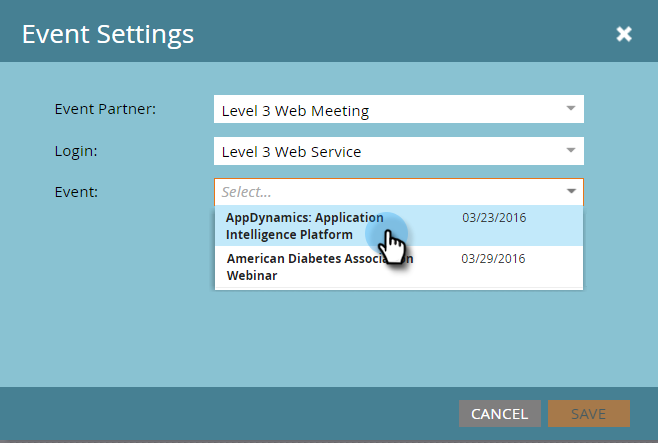

# [!DNL Level 3 Web Meeting]&#x200B;(으)로 이벤트 만들기 {#create-an-event-with-level-web-meeting}

>[!PREREQUISITES]
>
>* [추가 [!DNL Level 3 Web Meeting] as a [!DNL LaunchPoint] 서비스](/help/marketo/product-docs/administration/additional-integrations/add-level-3-web-meeting-as-a-launchpoint-service.md)
>* [새 이벤트 프로그램 만들기](/help/marketo/product-docs/demand-generation/events/understanding-events/create-a-new-event-program.md)
>* 참여를 추적하려면 적절한 [흐름 동작](/help/marketo/product-docs/core-marketo-concepts/smart-campaigns/flow-actions/add-a-flow-step-to-a-smart-campaign.md)을 설정하십시오.

먼저 [!DNL Level 3]에서 웨비나를 만듭니다. 도움이 필요하면 [[!DNL Level 3] 리소스 라이브러리](https://www.level3.com/en/resource-library/)를 확인하십시오. [!DNL BrightTalk]과(와) 매우 유사합니다.  Marketo에서는 [!DNL Level 3] 필드의 작은 하위 집합을 사용합니다.

* **이름** - 웹캐스트의 이름입니다.
* **시작 날짜** - 웹캐스트의 시작 날짜입니다.
* **종료 날짜** - 웹캐스트의 종료 날짜입니다.
* **시간대** - 웹캐스트에 설정된 시간대입니다.
* **설명** - 웹캐스트 설명입니다.

1. 새 이벤트를 선택합니다. **[!UICONTROL Event Actions],**&#x200B;을 클릭한 다음 **[!UICONTROL Event Settings].**&#x200B;을 클릭합니다.

   

1. [!UICONTROL Event Partner]에서 **[!UICONTROL Level 3 Web Meeting]**&#x200B;을(를) 선택합니다.

   

1. [!UICONTROL Login]에서 [!DNL Level 3] 로그인을 선택합니다.

   

1. [!UICONTROL Event]에서 사용할 [!DNL Level 3] 이벤트를 선택합니다.

   

1. **[!UICONTROL Save]**&#x200B;을(를) 클릭합니다.

   

   최고입니다! 이벤트를 [!DNL Level 3]에 연결했습니다!

## 일정 보기  {#viewing-the-schedule}

프로그램 일정 보기에서 이벤트의 달력 항목을 클릭합니다. 일정표는 화면 오른쪽에 있습니다!

