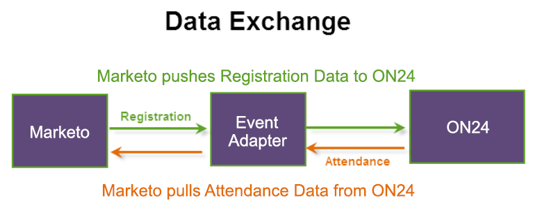

# Marketo에서 이벤트 만들기 {#create-an-event-in-marketo}

Marketo 이벤트는 프로그램을 통해 사용자의 진행 상황을 추적합니다. 등록 정보를 푸시하고 ON24 어댑터를 사용하여 참석 정보를 가져옵니다. 이 이벤트는 사람들의 진행 상태를 이 이벤트를 통해 캡처합니다.

데이터를 교환하는 방법은 다음과 같습니다.

Marketo 이벤트를 만들 때 **웨비나** 를 채널 유형으로 사용할 수 있습니다. 관리에서 이 채널을 편집하고 새 채널을 만들 수 있습니다. 새 채널을 만드는 경우 유형이 같아야 합니다 **웨비나를 사용하는 이벤트** 를 사용하도록 선택할 수 있습니다. 자세한 내용은 [프로그램 채널 만들기](/help/marketo/product-docs/administration/tags/create-a-program-channel.md)자세한 내용은 {target=&quot;_blank&quot;} 를 참조하십시오.

다음 단계는 다음과 같습니다. [이벤트 설정 구성 및 웨비나와 Marketo 동기화](/help/marketo/product-docs/demand-generation/events/create-an-event/create-an-event-with-the-marketo-on24-adapter/configure-event-settings-and-sync-marketo-with-your-webinar.md){target=&quot;_blank&quot;}.

>[!MORELIKETHIS]
>
>[Marketo ON24 어댑터 이벤트 이해](/help/marketo/product-docs/demand-generation/events/create-an-event/create-an-event-with-the-marketo-on24-adapter/understanding-marketo-on24-adapter-events.md){target=&quot;_blank&quot;}
