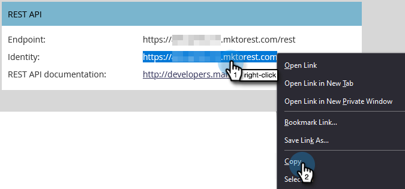

# Marketo와 ON24 통합 설정{#set-up-the-on24-integration-with-marketo}

다음은 ON24 이벤트 통합을 설정하는 방법입니다.

## API 전용 역할 만들기 {#create-an-api-only-role}

1. 내 Marketo에서 **[!UICONTROL Admin]**&#x200B;을(를) 클릭합니다.

   

1. [!UICONTROL Security]에서 **[!UICONTROL Users & Roles]**&#x200B;을(를) 클릭합니다.

   

1. **[!UICONTROL Roles]** 탭을 클릭한 다음 **[!UICONTROL New Role]**&#x200B;을(를) 클릭합니다.

   

1. [!UICONTROL Role Name] 입력. **[!UICONTROL Access API]** 메뉴를 열고 &quot;[!UICONTROL Read-Write Custom Object]&quot; 및 &quot;[!UICONTROL Read-Write Person]&quot;을(를) 선택합니다. **[!UICONTROL Create]**&#x200B;를 클릭합니다.

   

## 새 사용자 만들기 {#create-a-new-user}

1. [!UICONTROL Users & Roles]에서 **[!UICONTROL Users]** 탭을 클릭하고 **[!UICONTROL Invite New User]**&#x200B;을(를) 클릭합니다.

   

1. 새 사용자 정보를 입력하고 **[!UICONTROL Next]**&#x200B;을(를) 클릭합니다.

   

1. 방금 만든 [!UICONTROL ON24 API Only Role (all workspaces)]을(를) 선택합니다. **[!UICONTROL API Only]** 확인란을 선택합니다. **[!UICONTROL Next]**&#x200B;를 클릭합니다.

   

1. **[!UICONTROL Send]**&#x200B;를 클릭합니다.

   

>[!NOTE]
>
>API 전용 사용자에게는 초대가 필요하지 않습니다.

## ON24 연결 설정 {#set-up-on24-connection}

1. [!UICONTROL Admin] 섹션에서 **[!UICONTROL LaunchPoint]**&#x200B;을(를) 클릭합니다.

   

1. **[!UICONTROL New]**&#x200B;을(를) 클릭한 다음 **[!UICONTROL New Service]**&#x200B;을(를) 클릭합니다.

   

1. [!UICONTROL display name] 선택. **[!UICONTROL Service]** 드롭다운을 클릭하고 **[!UICONTROL Custom]**&#x200B;을(를) 선택합니다. [!UICONTROL description] 입력. [!UICONTROL API Only User] 드롭다운을 클릭하고 위의 단계[에서 ](#create-a-new-user)을(를) 만든 사용자를 선택합니다. **[!UICONTROL Create]**&#x200B;를 클릭합니다.

   

1. 방금 만든 사용자 지정 [!DNL LaunchPoint] 서비스를 찾은 다음 [!UICONTROL View Details]을(를) 클릭합니다.

   

1. [!UICONTROL Client ID]을(를) 강조 표시하고, 마우스 오른쪽 단추로 클릭하고, 복사하고, 저장합니다(나중에 필요함). [!UICONTROL Client Secret]에 대해 반복합니다.

   

1. 왼쪽의 트리에서 **[!UICONTROL Web Services]**&#x200B;을(를) 클릭합니다.

   

1. &quot;[!UICONTROL REST API]&quot; 아래에서 [!UICONTROL Identity]의 첫 부분을 마우스 오른쪽 단추로 클릭하고 복사한 후 저장합니다(.com의 &#39;m&#39;까지).

   

1. 저장된 클라이언트 ID, 클라이언트 암호 및 ID를 사용하여 ON24 계정으로 이동합니다. 나머지 단계는 여기에서 수행되며 [ON24 설명서](https://support.on24.com/hc/en-us/articles/21420762650523-Data-Integration-Setup-Instructions-When-Using-Marketo-Registration-Option-1){target="_blank"}에서 찾을 수 있습니다.
